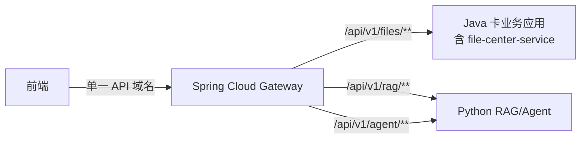

# ADR-003 目标架构使用 Gateway 统一 Java 与 Python 入口

- 日期：2026-09-03
- 状态：目标方向已由用户确认；本文细节 `DRAFT_FOR_USER_REVIEW / NOT_APPROVED_FOR_IMPLEMENTATION`
- 目标组件：Spring Cloud Gateway 3.1.4

## 1. 背景

旧模块化单体裁决曾删除 Gateway，前提是只有 Java 对外提供 HTTP，Python 只在后台消费 RocketMQ。该前提已经被新需求推翻：前端需要调用 Java 文件 API，也需要调用 Python 的 RAG/Agent API。

已确认事实依据：

- 用户原文：“前端是需要直接访问python服务的，python的rag，agent接口是要对前端暴露的”；
- 用户随后明确 V0.1.0 只做 Java 文件管理，RAG 不真实接入；
- Spring Cloud Gateway 3.1.4 由 Spring Cloud 2021.0.5 BOM 管理，版本依据为外部设计输入 `spring-cloud-alibaba-baseline.md` 第 3 节。

## 2. 决策

### 2.1 目标架构

Python API 进入交付范围时，新增独立 Spring Cloud Gateway 进程作为浏览器统一入口：

Gateway 可以代理任何遵循 HTTP、SSE 或 WebSocket 的后端，不要求下游使用 Java。Gateway 与 Java 卡业务应用是两个独立进程；Java 卡业务应用内部的文件模块和后续 Java 业务模块仍共享一个 Spring Boot JVM。Gateway 基于 WebFlux，不嵌入 Java MVC 业务应用。

### 2.2 V0.1.0 行为

V0.1.0 不创建或启动 Gateway。前端/测试客户端直接访问 `card-service-app` 暴露的文件接口，理由是本期只有一个 Java HTTP 运行宿主。Gateway 3.1.4 仅冻结为目标架构版本。

### 2.3 路由职责

- Java 文件接口：`/api/v1/files/**`；
- Python RAG 接口：`/api/v1/rag/**`；
- Python Agent 接口：`/api/v1/agent/**`；
- WebSocket 如采用独立路径，应使用明确的 `/ws/...` 路由；
- SSE 使用 HTTP 路由，但必须单独验证超时、响应缓冲、客户端取消和断线行为。

精确路径仍以 SRS/API LLD 为准。这里冻结的是职责边界，不凭空确认 Python 尚未设计的具体 Endpoint。

### 2.4 服务定位

首个 Gateway 版本可以使用部署平台 DNS/静态服务地址。Nacos Discovery 只有在多实例发现、动态上下线或统一注册确有需求且经过组合验证时启用；不因为使用 Gateway 就自动要求 Python 注册 Nacos。

如果启用 `lb://service-name`，必须真实验证 Java/Python 注册、健康检查、实例下线和路由行为。外部基线只证明 Nacos 2.2.4 的部分静态/PoC 事实，没有证明本项目 Starter 组合已运行。

## 3. 身份和安全边界

1. 浏览器只携带登录产生的可信 Token，不把自行填写的 `X-User-Id`、`X-Role` 当作身份事实。
2. Gateway 可以做 Token 结构/签名的第一层校验和路由级访问控制。
3. Java 与 Python 必须各自验证 Token 或验证 Gateway 签发的内部身份上下文，不能无条件信任浏览器可伪造的头。
4. Gateway 转发前应删除外部传入的内部身份头，再写入受保护的内部头；采用何种签名机制由安全 LLD 冻结。
5. Gateway 不持有 MinIO SecretKey、数据库密码或 RocketMQ 业务生产者职责。

这些是安全设计要求，尚无当前实现或渗透测试证据。

## 4. Gateway 不承担的职责

- 不替代 RocketMQ 的异步入库与结果回传；
- 不替代 MinIO 文件字节存储；
- 不执行业务事务或直接访问 Java/Python 数据库；
- 不把 RAG/Agent 的长耗时任务转换成数据库事务；
- 不成为唯一鉴权点；
- 不证明下游 RAG 已正确执行。

## 5. 原因

- 目标系统有两个对前端提供 API 的独立服务，统一入口可减少前端服务地址、跨域和 Token 处理分叉。
- 路由级限流、请求 ID、统一错误边界和后端地址隐藏有明确入口职责。
- 保留 Java 卡业务应用和 Python RAG/Agent 的独立部署、语言和扩缩容边界；Java 内部业务模块不因此拆成独立微服务。

以上是基于已确认拓扑的设计推理。具体吞吐收益、资源成本和延迟开销尚未测量。

## 6. 后果

### 6.1 正向结果

- 前端只依赖一个公开 API 域名。
- Java 与 Python 路由规则、跨域和入口观测可集中管理。
- 后续可以分别为短请求、文件传输和 Agent 长连接设置策略。

### 6.2 代价与风险

- 新增一个 JVM/容器、配置和故障节点。
- 文件上传/下载和 SSE/WebSocket 都多一层代理，必须验证流式传输、背压、超时和客户端取消。
- 错误的全局过滤器可能缓存响应体、吞掉流式块或覆盖下游错误语义。
- 若 Gateway 与下游身份校验不一致，会产生越权或不可诊断的 401/403。

## 7. 被否决方案

### 7.1 永久让前端分别维护 Java 与 Python 地址

否决为目标方案：会把跨域、Token、错误处理和环境地址选择分散到前端。它只作为 V0.1.0 单后端阶段的暂时运行方式。

### 7.2 把 Gateway 嵌入 Java MVC 业务应用

否决原因：混合响应式 Gateway 与 MVC 业务进程，使入口故障和文件业务故障共享进程，也破坏独立部署边界。

### 7.3 所有 Java/Python 通信都经过 Gateway

否决原因：Gateway 解决 HTTP 入口路由；文档异步入库和结果回传需要 RocketMQ 的异步、重投和消费语义。

## 8. 启用门禁

1. Python RAG/Agent 的 HTTP/SSE/WebSocket API 和认证合同已冻结。
2. Gateway 到 Java、Python 的实际服务定位方式已选择。
3. 文件上传/下载经过 Gateway 后仍保持流式，字节和 SHA-256 不变。
4. SSE 验证首块延迟、逐块到达、连接超时和客户端取消；WebSocket 如使用则单独验证升级与断连。
5. 外部伪造身份头被清除，下游独立鉴权通过。
6. Gateway 不可用、下游不可用、超时和限流均产生稳定且可追踪的错误。

门禁未执行前，只能表述“Gateway 目标架构已设计”，不能表述“统一入口已接入”。
