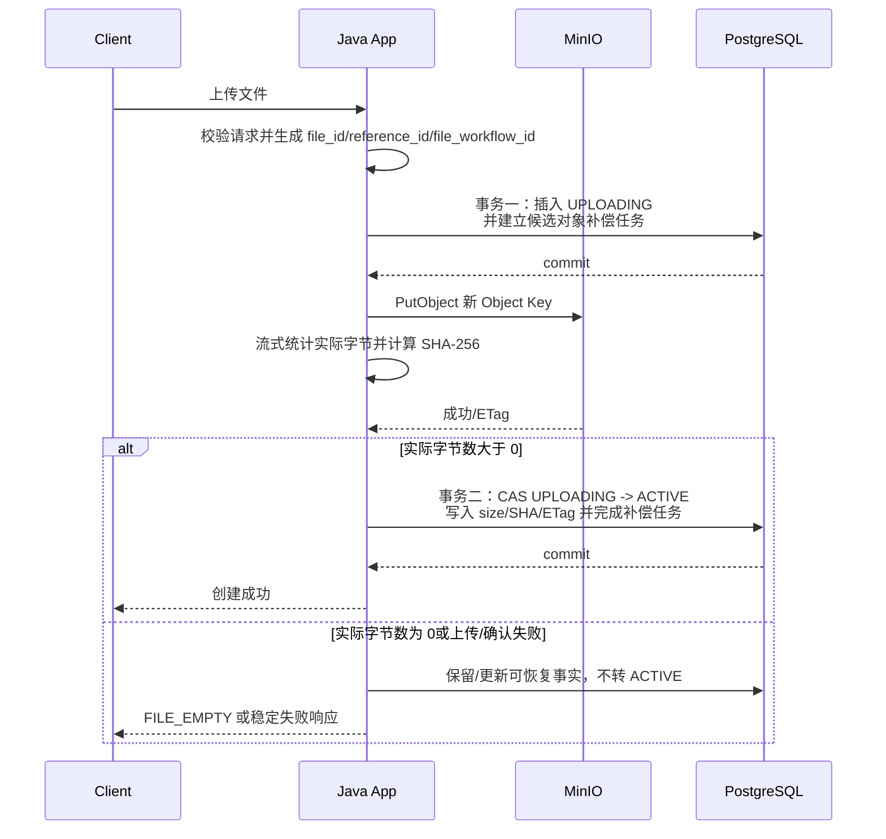
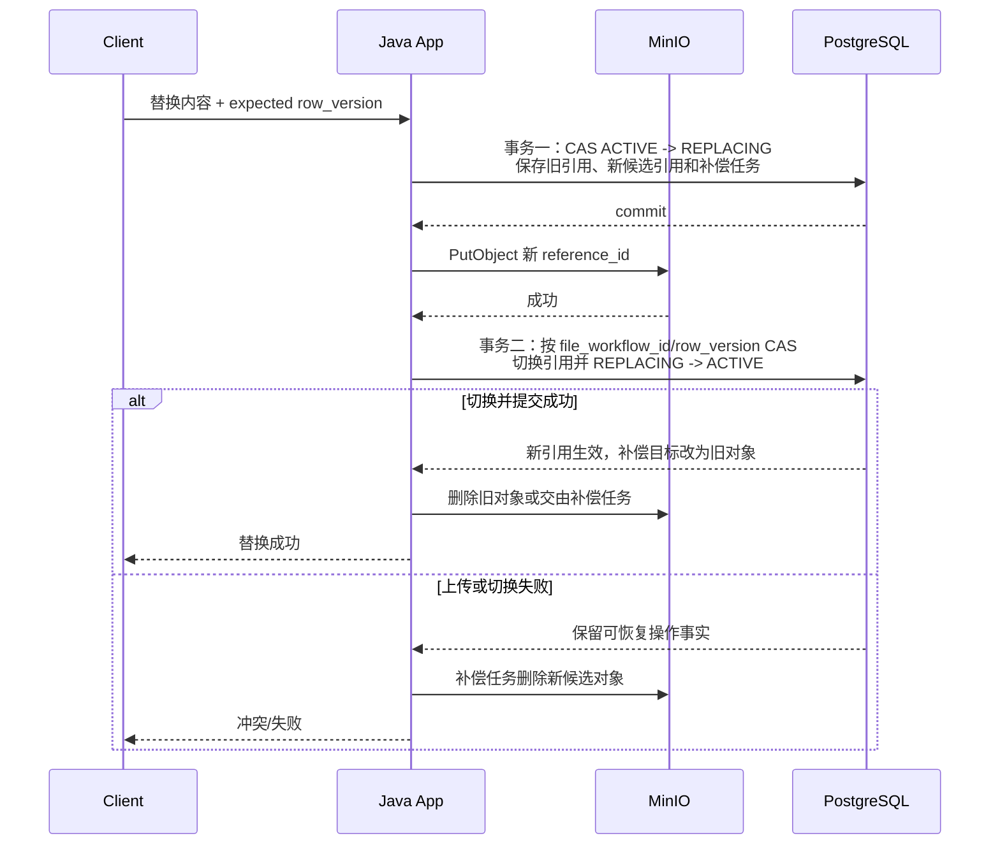

# ADR-004 PostgreSQL 与 MinIO 一致性策略

- 日期：2026-09-03
- 状态：`DRAFT_FOR_USER_REVIEW / NOT_APPROVED_FOR_IMPLEMENTATION`
- 适用版本：V0.1.0 起

## 1. 背景

文件中心把文件元数据和生命周期保存在 PostgreSQL，把文件字节保存在 MinIO。二者是独立事务资源：Spring `@Transactional` 只能覆盖数据库事务，不能回滚已经成功的 MinIO 操作。

依据：外部设计输入 `resource-version-baseline.md` 第 10 节明确记录了新建、替换、删除的补偿策略；`modular-monolith-decision.md` 第 4 节同样指出 MinIO 不参加数据库事务。当前工程尚未实现，这些是设计决定，不是已执行结果。

## 2. 决策

不使用 Seata 或把 PostgreSQL/MinIO 包装成伪原子事务。采用：

- PostgreSQL 本地事务；
- 不可变 Object Key；
- 文件生命周期状态机；
- `row_version` 乐观锁；
- 操作幂等；
- 外部存储操作前持久化补偿任务；
- 提交后补偿和定时对账；
- SHA-256 内容完整性校验。

## 3. 不变量

1. 数据库不保存文件 BLOB，只保存稳定文件 ID、对象引用、大小、媒体类型、SHA-256、ETag、系统生命周期、人工可用状态、状态历史和并发版本等元数据。
2. 一个文件内容版本使用一个新的 Object Key；替换内容不得覆盖当前 Object Key。
3. MinIO ETag 与 SHA-256 分字段保存，任何流程不得把 ETag 当作内容哈希。
4. 对外下载只允许数据库已确认可用的状态；不能通过用户输入直接拼 Bucket/Object Key。
5. Object Key 使用无 `/`、`\\` 的随机稳定 `reference_id`，满足冻结的本地 RAG 文件引用合同。
6. Bucket 为私有；存储凭据只存在于部署密钥边界。
7. 同一文件的元数据修改、替换、启停、失败恢复请求和删除通过 `row_version` 条件更新，更新行数为 0 表示并发冲突，不能静默覆盖。
8. 任何可能产生、替换或删除 MinIO 对象的流程，必须先在 PostgreSQL 本地事务中保存文件状态、目标 Object Key、操作身份和补偿任务，再调用 MinIO。进程在外部调用任一点崩溃后，数据库中都必须存在可供对账接管的事实。
9. 零字节文件必须拒绝并返回稳定错误码 `FILE_EMPTY`；不得转为 `ACTIVE`，也不得留下没有数据库身份和补偿任务的对象。

本文 Java 内部文件流程身份统一称为 `file_workflow_id`。涉及 PostgreSQL/MinIO 的流程可跨 TX1、事务外对象操作和 TX2 复用该值，以供恢复与对账；单事务文件命令也使用同一命名规则。它不是 ADR-002 中 `file_fact_changed.operation_id`；后者只标识一份不可变消息事件。

## 4. 状态模型

统一文件状态：

| 状态 | 含义 | 可下载 | 可修改元数据 | 可替换内容 | 可删除 |
|---|---|---:|---:|---:|---:|
| `UPLOADING` | 已在数据库预留文件和候选对象，上传尚未完成 | 否 | 否 | 否 | 否 |
| `ACTIVE` | 数据库引用与对象已确认可用 | 是 | 是 | 是 | 是 |
| `REPLACING` | 已预留新候选对象，内容替换尚未收口 | 仅 `availability_status=ENABLED`，只读取旧的已提交当前对象 | 否 | 否 | 否 |
| `DELETING` | 已接受删除，正在删除/等待重试对象 | 否 | 否 | 否 | 重复请求返回稳定结果 |
| `DELETED` | 逻辑删除完成；对象应不存在 | 否 | 否 | 否 | 重复请求返回稳定结果 |
| `FAILED` | 创建、替换或清理出现无法立即收口的失败 | 否 | 否 | 否 | 由补偿/人工处理规则决定 |

允许的主状态转换：

```text
新建：       [无] -> UPLOADING -> ACTIVE
                         \-----> FAILED
替换：       ACTIVE -> REPLACING -> ACTIVE（切换到新对象）
                                  -> ACTIVE（替换失败，恢复旧对象）
                                  -> FAILED（旧对象也不可恢复）
删除：       ACTIVE -> DELETING -> DELETED
                         \------> FAILED（达到需人工处理的失败条件）
```

`UPLOADING`、`REPLACING`、`DELETING` 都是持久状态，不是只存在于线程内的变量。超时记录必须由补偿/对账任务按照操作身份和 Object Key 收敛，不能永久停留或被列表伪装成 `ACTIVE`。外部普通列表默认只返回 `ACTIVE`；其他状态只通过受控的状态查询或运维诊断查看。

人工可用状态独立为 `ENABLED/DISABLED`。普通业务只有 `ACTIVE + ENABLED` 可用；启停只允许生命周期为 `ACTIVE` 并使用 `expectedVersion`。生命周期或可用状态实际变化与对应状态历史必须在同一个 PostgreSQL 本地事务提交。替换保留原可用状态，不能把停用文件自动恢复为可用。

## 5. 新建文件



规则：

1. 上传前生成稳定 `file_id`、新的 `reference_id` 和本次 `file_workflow_id`。
2. 第一个 PostgreSQL 本地事务插入 `UPLOADING` 文件记录，并同时插入指向候选 Object Key 的持久补偿任务；二者任一写入失败都不得调用 MinIO。
3. 事务一提交后，才流式调用 PutObject，并对实际读取的字节统计大小、计算 SHA-256。若 SDK 需要已知长度，具体临时缓冲策略由 LLD 定义，但不得把不受控大文件整体载入 JVM 堆。
4. 请求声明长度为零时应在事务一之前拒绝；无声明长度或声明与实际不符时，以实际读取字节为准。实际字节数为零时返回 `FILE_EMPTY`，不转 `ACTIVE`，候选对象由已持久化补偿任务删除。
5. PutObject 和完整性事实确认后，第二个 PostgreSQL 本地事务以 `file_id + file_workflow_id + status=UPLOADING + row_version` 做 CAS，填充 size、SHA-256、ETag 和当前对象引用，转为 `ACTIVE`，并在同一事务完成本次候选清理任务。
6. PutObject 失败、结果不确定或事务二失败时，记录保持 `UPLOADING` 或转为 `FAILED`，补偿任务保持待处理；请求线程可以尝试即时补偿，但不得只依赖内存中的 best-effort 删除。
7. `UPLOADING` 超过安全窗口后，对账任务读取同一数据库操作事实并检查对象。若无法证明字节、大小和 SHA-256 均完整，不得自动提升为 `ACTIVE`；应清理候选对象并转为 `FAILED`。具体安全窗口由配置和验收冻结。
8. API 重试的幂等键和同键不同内容的冲突语义由 API LLD 冻结；未定义幂等键前，不得假设网络重试不会重复创建。

## 6. 修改元数据

文件名、备注、分类等元数据更新只修改 PostgreSQL，不重写 MinIO 对象。更新使用 `file_id + row_version + status=ACTIVE` 条件；成功后递增 `row_version`。

MinIO 用户元数据中的 `file_name` 若必须与业务文件名同步，需要复制对象或调用受支持的元数据更新能力，会重新引入跨资源一致性。V0.1.0 应明确区分：

- 数据库中的展示名称是业务事实；
- MinIO `file_name` 是上传时供冻结 RAG 本地适配器读取的对象元数据。

是否要求每次改名同步对象元数据必须在 SRS/LLD 冻结。在没有该需求前，不声称二者永远强一致。

## 7. 替换文件内容



规则：

1. 正文只能由调用方上传一份完整新文件；新内容永远写新 Object Key，不提供服务端正文增量编辑；替换请求也必须拒绝实际零字节内容并返回 `FILE_EMPTY`。
2. 事务一以 `file_id + expected row_version + status=ACTIVE` 做 CAS，转为 `REPLACING`，保存旧的当前对象事实、新的候选 Object Key、`file_workflow_id` 和候选清理任务。CAS 失败时不调用 MinIO。
3. PutObject 成功后，事务二只允许同一 `file_workflow_id` 和预期 `row_version` 把候选对象原子切换为当前对象，将状态恢复为 `ACTIVE`，并保持替换前的 `availability_status`。
4. 切换提交时，在同一事务把补偿任务的清理目标从“新候选对象”改为“旧对象”；因此提交后进程崩溃也能继续删除旧对象。
5. 新对象上传或切换失败时，补偿任务删除候选对象；旧对象仍完整时，CAS 恢复原引用并转回 `ACTIVE`。只有旧对象也无法证明可用、无法安全恢复时才转 `FAILED`。
6. 新引用提交后删除旧对象失败，不回滚已经生效的新版本；记录保持 `ACTIVE`，持久补偿任务继续清理旧对象。
7. `REPLACING` 超时由对账任务按 `file_workflow_id` 判定数据库当前引用和候选对象状态，再选择完成切换、恢复旧 `ACTIVE` 或转 `FAILED`。不能只看 MinIO 中“有对象”就推断切换成功。
8. `REPLACING` 期间，原可用状态为 `ENABLED` 时普通下载继续读取替换开始前已提交的当前对象；原状态为 `DISABLED` 时仍拒绝下载。候选对象在事务二成功切换前绝不能被下载、详情响应或 RAG 引用读取。元数据修改、再次替换和删除仍被拒绝。

## 8. 删除文件

1. PostgreSQL 本地事务用 `file_id + row_version + status=ACTIVE` 把状态改为 `DELETING`，并在同一事务插入当前对象的持久删除补偿任务。
2. 事务提交后删除当前 MinIO 对象。
3. 删除成功或对象已不存在时，把记录改为 `DELETED`，保存删除完成时间。
4. MinIO 暂时失败时保留 `DELETING`，由已持久化的任务继续；下载和修改均拒绝该状态。
5. 客户端重复 DELETE 时，对 `DELETING`/`DELETED` 返回稳定幂等语义，不创建第二条并发删除流程。
6. 重试必须有退避、最大单次占用时间和可观测失败记录；最终人工处理阈值由运维需求另行冻结，不编造次数。

数据库记录的最终物理清理和保留期属于数据保留需求，目前没有确认，V0.1.0 先保留逻辑删除事实。

## 9. 下载与完整性

- 按 `file_id` 查询 `availability_status=ENABLED` 且生命周期为 `ACTIVE` 或 `REPLACING` 的元数据，再由基础设施层只使用已提交的当前对象引用读取；`DISABLED` 一律拒绝下载，`REPLACING` 的候选引用不进入下载 DTO，也不能由客户端指定；
- 响应采用流式传输，不把整个对象放入 JVM 堆；
- 对象不存在、大小或元数据异常时返回稳定存储一致性错误并记录对账线索；
- SHA-256 在上传时冻结。是否每次下载都在线重算会影响吞吐，当前只要求验收/对账能对同一字节重算；生产在线校验策略由性能与完整性需求决定。

最后一点是待决策略，不得在没有测量时声称“每次下载重算没有性能影响”。

## 10. 对账与清理

至少设计两种方向：

### 10.1 数据库 → MinIO

- 超时 `UPLOADING` 必须按操作事实清理候选对象并收敛到 `FAILED`，除非有充分事实安全完成 `ACTIVE` 确认；
- `ACTIVE` 记录的对象必须存在；
- 超时 `REPLACING` 必须核对旧引用、候选引用、`file_workflow_id` 和补偿任务，收敛到旧/新 `ACTIVE` 或 `FAILED`；
- `DELETING` 记录应推进删除重试；
- `DELETED` 记录若仍有对象，应继续清理；
- `FAILED` 记录必须保留失败阶段和可诊断错误事实，并继续处理尚未完成的对象补偿；
- 对象 size/ETag/必要元数据与数据库不符时记录异常，不自动覆盖业务事实。

### 10.2 MinIO → 数据库

- 只扫描本应用拥有的 Bucket/命名空间；
- 在安全窗口之前不删除新对象，避免与正在进行的上传竞争；
- 没有任何数据库引用且超过安全窗口的对象进入孤儿候选；
- 自动删除前应具备幂等记录和审计信息，避免扫描器故障造成无证据删除。

扫描周期、安全窗口、重试上限和告警阈值尚无需求或运行数据，由 LLD/运维设计后续冻结。

## 11. 故障语义

| 故障点 | 数据库事实 | 对象事实 | 后续动作 |
|---|---|---|---|
| 上传事务一失败 | 无 `UPLOADING`/补偿任务 | 尚未调用 MinIO | 返回持久化失败 |
| PutObject 失败或结果不确定 | `UPLOADING` + 待处理任务 | 可能无对象或存在候选对象 | stat/清理后转 `FAILED`，不得转 `ACTIVE` |
| PutObject 成功、确认事务失败 | `UPLOADING` + 待处理任务 | 新对象存在 | 对账按 operation id 清理或在事实充分时完成确认 |
| 实际字节为零 | `UPLOADING` 或已转 `FAILED` + 补偿事实 | 可能存在零字节候选对象 | 返回 `FILE_EMPTY`，删除候选，绝不转 `ACTIVE` |
| 替换事务一 CAS 失败 | 仍为原 `ACTIVE` | 尚未调用 MinIO | 返回并发冲突 |
| 替换新对象成功、切换 CAS/事务失败 | `REPLACING` + 候选补偿任务 | 旧对象有效，新对象为候选 | 删除候选并恢复旧 `ACTIVE`；无法恢复才 `FAILED` |
| 替换 DB 提交成功、删旧对象失败 | 新对象引用 `ACTIVE` + 旧对象清理任务 | 新旧对象同时存在 | 补偿任务清理旧对象，不回滚新引用 |
| 删除置 `DELETING` 后 MinIO 失败 | `DELETING` | 对象仍可能存在 | 定时重试，禁止下载 |
| MinIO 删除成功、标记 `DELETED` 前崩溃 | `DELETING` | 对象不存在 | 重试将“对象不存在”视为删除成功并收口 |

## 12. 被否决方案

### 12.1 依赖 `@Transactional` 自动回滚 MinIO

否决原因：MinIO 不在 PostgreSQL 本地事务中，该假设在技术上不成立。

### 12.2 用同一 Object Key 原地覆盖

否决原因：并发下载、数据库回滚和旧版本清理都失去稳定指向，故障后难以判断数据库对应哪份字节。

### 12.3 用 MinIO ETag 作为 SHA-256

否决原因：分片上传时 ETag 不等于完整对象内容的 SHA-256；外部基线已明确禁止该做法。

### 12.4 引入分布式事务协调器

否决原因：对象存储操作并不会因此获得与 PostgreSQL 等价的 ACID 回滚；当前可恢复状态机与补偿更符合实际资源语义。

## 13. 验证要求

- 新建时数据库失败后的对象补偿；
- 上传事务一失败时验证 MinIO 未被调用；
- 进程在事务一提交、PutObject、事务二确认等中断点失败后，验证持久补偿任务与超时对账能收敛 `UPLOADING`；
- 两个并发替换只有一个 `row_version` 条件更新成功；
- 替换处于 `REPLACING + ENABLED` 时，下载仍返回旧的已提交当前对象且字节/SHA-256 不变，候选对象不可见；`REPLACING + DISABLED` 时下载被拒绝；
- `REPLACING` 在新对象上传失败、切换事务失败和进程中断后恢复旧 `ACTIVE` 或进入可诊断的 `FAILED`；
- 替换后旧对象删除失败不影响新版本下载，并能被清理；
- 重复删除、对象已不存在、MinIO 短暂不可用均能收口到稳定状态；
- 上传原文件、数据库 SHA-256、下载字节重算三者一致；
- 中文文件名、同名不同文件和受控大文件的真实组合行为；
- 上传和替换零字节内容均返回 `FILE_EMPTY`，不产生 `ACTIVE` 记录，也不留下无数据库身份的对象。

这些验证必须使用指定 PostgreSQL 15.19 与 MinIO Server/Java SDK 组合。单元测试或 Mock 只能验证分支逻辑，不能证明跨资源行为。

## 14. 与未来 MQ 原子发布的边界

本 ADR 的 PostgreSQL/MinIO 补偿策略与未来 MQ Transactional Outbox 是两层不同边界：

1. PostgreSQL 与 MinIO 仍按“数据库 TX1 → 事务外对象操作 → 数据库 TX2”收敛，不能形成单一 ACID 提交；
2. 当 MQ 进入后续版本时，只有已经在 PostgreSQL 提交的文件事实才能生成事件；文件行、状态历史、RAG delivery operation 和完整不可变 Outbox payload/hash 必须在同一个 PostgreSQL 本地事务写入；
3. Sender 只能在提交后发送，重试复用 Outbox 原始 payload，禁止读取后来文件快照重建旧事件；
4. 替换候选对象或 `REPLACING` 中间态不得通知 RAG；只有 TX2 原子切换后才能冻结 `CONTENT_REPLACED`，并同时保存新旧 `document_id`。

每个已提交事件必须拥有独立的 `file_fact_changed.operation_id`。同一个 `file_workflow_id` 若跨多个事务形成两份不同 payload，不得作为两份事件的共同幂等键；应在内部关联表或日志中保存两类 ID 的对应关系。

V0.1.0 只冻结这条规则，不创建 Outbox/RAG delivery operation/Inbox 表，不引入 RocketMQ SDK、Producer/Consumer、Topic/Group 或 MQ 运行配置。该边界的消息字段和提交点以 ADR-002、LLD-003 为准。
