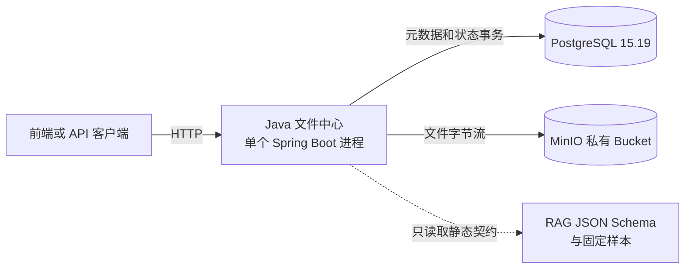
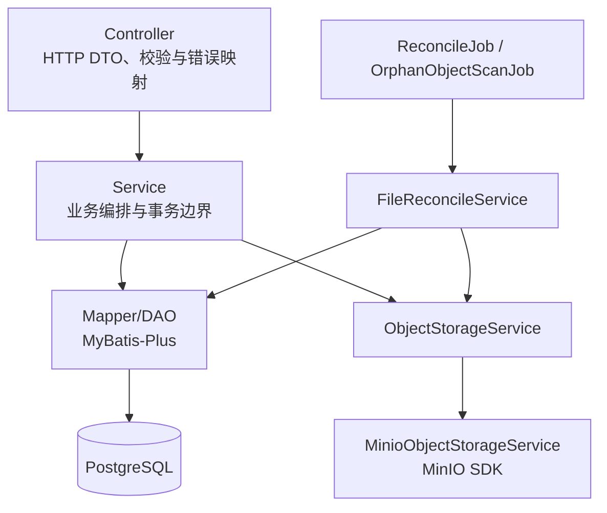
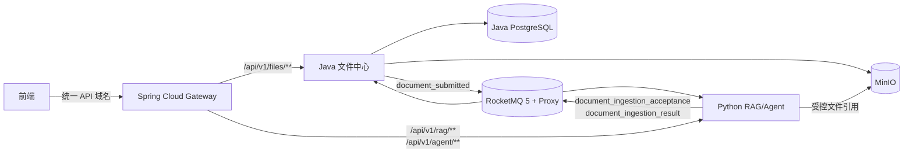

# HLD-001 系统架构与技术版本基线

- 文档版本：V0.1.0
- 日期：2026-09-03
- 状态：`DRAFT_FOR_USER_REVIEW / NOT_APPROVED_FOR_IMPLEMENTATION`
- 适用范围：Java 文件管理一期与后续 Java/Python 集成边界

## 1. 目的

本文提出 V0.1.0 的系统边界、目标架构、技术选型和版本状态，供用户评审。字段、接口、表结构和消息样本由 LLD 继续细化；本文不构成实施授权，也不把静态设计或契约测试表述为运行联通证据。

## 2. 输入依据与事实状态

| 编号 | 内容 | 性质 | 依据 |
|---|---|---|---|
| F-001 | V0.1.0 只实现 Java 文件管理；RAG 只设计对接契约，不真实接入 | 已确认需求 | 2026-09-03 用户原文：“第一版先只实现Java这边的文件管理功能，定好rag那边的对接契约不真实接入rag” |
| F-002 | 目标系统中，前端需要调用 Java API，也需要调用 Python 的 RAG/Agent API | 已确认需求 | 2026-09-03 用户原文：“前端是需要直接访问python服务的，python的rag，agent接口是要对前端暴露的” |
| F-003 | Java 侧采用一个 Spring Boot 进程的模块化单体 | 已接受的既有裁决 | 外部设计输入 `modular-monolith-decision.md` 第 1～3 节 |
| F-004 | 现有 RAG 对接基线已固定 RocketMQ Envelope、JSON Body 与 MinIO 引用约束 | 已完成静态审计；未完成本项目联通 | 外部设计输入 `compatibility-audit.md` 第 4～7 节 |
| F-005 | 当前 Java 工程尚未实现，因此没有启动、存储组合或端到端执行证据 | 已确认事实 | 外部设计输入 `spring-cloud-alibaba-baseline.md` 的“实施状态”和 `compatibility-audit.md` 第 7、9 节 |

上述外部设计输入位于：

```text
E:\software\codextalklog\artifacts\java_card_service\
2026-09-03-backend-resource-version-baseline\
```

## 3. V0.1.0 交付边界

### 3.1 本期实现

1. 文件上传：文件字节写入 MinIO，文件元数据写入 PostgreSQL，上传流同时计算 SHA-256。
2. 文件分页查询和单文件详情。
3. 文件内容流式下载，禁止把完整文件读入 JVM 堆。
4. 文件元数据修改；它与文件二进制替换是两个独立用例。
5. 文件二进制替换：写入新对象后，以数据库乐观锁切换对象引用。
6. 文件删除：以可恢复状态机协调 PostgreSQL 与 MinIO，并保证重复删除语义稳定。
7. 数据库迁移、统一错误响应、必要日志和健康检查。
8. RAG 跨语言契约文档、JSON Schema、固定 JSON 样本及序列化/反序列化契约验证设计。

### 3.2 本期不实现

- Python RAG/Agent 服务的启动或调用；
- 登录、用户、角色、租户和 ACL；本期接口只能在本地或受控隔离网络验收，不能声称已有用户级权限保护；
- RocketMQ Producer、Consumer、Topic/Group 初始化和真实消息收发；
- `rag_ingestion_operation`、Outbox、结果消费幂等处理等 RAG 运行能力；
- Spring Cloud Gateway 独立进程；
- Nacos 注册、配置监听或服务发现；
- Sentinel 运行规则；
- Elasticsearch、Milvus、Embedding 或 LLM 运行时；
- Java 与 Python 的端到端联调。

这些能力是延期范围，不得用空实现、假消费者或固定成功响应对外声称已接入。

## 4. V0.1.0 运行架构



运行期没有 Python、RocketMQ、Gateway 或 Nacos 节点。RAG 契约是构建期/评审期对象，不是运行依赖。

### 4.1 Java 内部分层



约束：

- 只有一个 Spring Boot 启动类和一个可执行 JAR；
- 模块内调用使用 Java 接口，不走 HTTP、Feign 或 MQ；
- 主调用方向固定为 `Controller → Service → Mapper/DAO → PostgreSQL`；Controller 不得直接依赖 Mapper 或 MinIO Client；
- Service 可以直接调用 MyBatis Mapper，并通过本项目的 `ObjectStorageService` 调用对象存储；Service 不得引用 MinIO SDK 类型；
- MyBatis-Plus 类型限制在 Mapper/数据访问代码，MinIO SDK 类型限制在 `storage/minio`；
- `ReconcileJob`、`OrphanObjectScanJob` 只能调用 `FileReconcileService`，由补偿 Service 访问 Mapper 和 `ObjectStorageService`；
- 精确包名和依赖方向由 LLD 冻结，HLD 只冻结上述边界。

## 5. 目标架构

Python RAG/Agent API 进入交付范围后，系统演进为三个独立部署单元：Gateway、Java 文件中心、Python RAG/Agent。



这张图表示目标方向，不表示 V0.1.0 已搭建或验证上述链路。Gateway 只统一外部 HTTP/SSE/WebSocket 入口；Java 与 Python 的文档异步入库仍由 RocketMQ 和 MinIO 引用承担。

## 6. 数据所有权和系统边界

| 所有者 | 拥有的数据 | 禁止的耦合 |
|---|---|---|
| Java 文件中心 | 文件身份、元数据、对象引用、SHA-256、文件生命周期与并发版本 | Python 不直接读写 Java 表 |
| MinIO | 文件字节与必要对象元数据 | 数据库不保存文件 BLOB；外部响应不暴露存储凭据 |
| Python RAG/Agent（后续） | 入库任务账本、解析结果、索引状态、对话/Agent 运行状态 | Java 不读写 Python 表 |
| RocketMQ（后续） | 服务间传输中的事件 | MQ 不是业务事实数据库 |

Java 和 Python 可以在本地复用同一基础设施进程，但必须使用独立数据库、账号和表；共享进程不改变业务数据所有权。

## 7. 技术版本基线

### 7.1 状态定义

- **冻结**：设计基线已经选定；实现必须通过可执行配置锁定该版本，变更需更新文档。
- **候选待验证**：版本来源或 Java 8 字节码已核对，但本项目尚未完成指定组合的构建/启动/行为验证。
- **目标架构冻结**：为后续服务边界预留的精确版本；V0.1.0 不启动该组件。
- **由 BOM 管理**：不单独手写版本，以冻结的 BOM 解析结果为准，并保存依赖树证据。

### 7.2 版本矩阵

| 范围 | 组件 | 版本 | 状态 | V0.1.0 用途 |
|---|---|---:|---|---|
| Java | Eclipse Temurin JDK | `8u492-b09`，编译 `release=8` | 冻结 | 编译与运行 |
| 构建 | Apache Maven | `3.9.14` | 冻结；应添加 Wrapper | 聚合构建 |
| 框架 | Spring Boot | `2.6.13` | 冻结 | Java 文件应用 |
| BOM | Spring Cloud | `2021.0.5` | 冻结 | 管理目标架构依赖；本期无 Cloud 运行职责 |
| BOM | Spring Cloud Alibaba | `2021.0.6.2` | 冻结 | 管理目标架构依赖；本期无 Alibaba 运行职责 |
| Web/API | Spring MVC、Jackson、Validation | Spring Boot 2.6.13 BOM 解析值 | 由 BOM 管理 | HTTP API |
| 数据库 | PostgreSQL Server | `15.19` | 冻结 | 文件元数据与状态 |
| JDBC | PostgreSQL JDBC Driver | `42.7.13` | 候选待验证 | Java 连接 PostgreSQL |
| 数据访问 | MyBatis-Plus Boot Starter | `3.5.3.2` | 候选待验证 | Mapper/DAO 数据访问层 |
| 迁移 | Flyway | `9.22.3` | 候选待验证 | 数据库 Schema 迁移 |
| 对象存储 | MinIO Server | `RELEASE.2023-06-29T05-12-28Z` | 冻结为本地兼容基线；不是生产安全选型结论 | 文件字节存储 |
| 对象存储 | `io.minio:minio` | `8.5.17` | 候选待验证 | `MinioObjectStorageService` 的存储客户端 |
| API 文档 | Springdoc OpenAPI UI | `1.6.14` | 候选待验证 | API 文档；需验证 multipart/下载渲染 |
| 网关 | Spring Cloud Gateway | `3.1.4` | 目标架构冻结 | 本期不启动 |
| 配置/发现 | Nacos Server | `2.2.3` | 目标架构冻结 | 本期不启动 |
| 配置/发现 | Nacos Java Client | `2.2.4`，显式覆盖 BOM 的 `2.2.0` | 目标架构冻结；Starter 组合待验证 | 本期不依赖 |
| 流控 | Sentinel | `1.8.6` | 目标架构冻结 | 本期不启用规则 |
| 消息服务 | RocketMQ Server/Proxy | `5.1.4` | RAG 契约/目标架构冻结 | 本期不启动 |
| Java 消息 SDK | `rocketmq-client-java` | `5.0.5` | RAG 契约/目标架构冻结 | 本期不引入运行依赖 |
| Python 消息 SDK | `rocketmq-python-client` | `5.1.1` | 现有 RAG 对接基线 | Java 工程不引入 |
| Python 对象存储 SDK | `minio` | `7.1.15` | 现有 RAG 对接基线 | 只用于跨语言兼容约束 |

版本来源：Spring Boot/Cloud/Alibaba/Nacos/Sentinel/Gateway 矩阵来自外部设计输入 `spring-cloud-alibaba-baseline.md` 第 2～3 节；RocketMQ、MinIO 和 PostgreSQL 对接矩阵来自 `compatibility-audit.md` 第 2 节；MyBatis-Plus、Flyway、MinIO Java SDK 的“候选”边界来自上述两份基线。当前没有本项目运行证据，不能将候选标成已验证。

## 8. 版本锁定的可执行位置

Markdown 只解释选型，不能约束实际解析版本。实现时必须在以下位置形成单一可执行事实：

| 对象 | 锁定位置 |
|---|---|
| JDK 编译级别与 Java 依赖 | 根 `pom.xml` 的 properties、`dependencyManagement` 和插件管理 |
| Boot/Cloud/Alibaba 版本 | 根 `pom.xml` 的 BOM import |
| Maven | `.mvn/wrapper/maven-wrapper.properties` |
| PostgreSQL/MinIO 镜像 | Compose 精确 tag；正式留证时补充 digest |
| 数据库结构 | Flyway 版本化迁移脚本 |
| 跨语言消息 | JSON Schema、固定 JSON 样本及其 SHA-256 |
| Python 依赖（后续） | Python 项目的 `pyproject.toml` 和锁文件，不由 Java POM 管理 |

实现后应保存 `mvn dependency:tree`，确认没有多套 Nacos Client、Jackson 或 RocketMQ 4.x/5.x 客户端混入同一运行路径。

## 9. RAG 契约边界

V0.1.0 冻结但不执行以下兼容点：

- 入库 Topic：`card_rag_doc_intake`，FIFO；Tag：`document_submitted`；Key：`operation_id`；MessageGroup：`document_id`；Body `schema_version=2.0`。
- 接纳 Topic：`card_rag_document_result`；Tag：`document_ingestion_acceptance`；Key/MessageGroup：`operation_id`；Body `schema_version=1.0`，严格区分 `ACCEPTED`、`REJECTED`、`CONFLICT` 三个互斥分支。该事件用于补齐 Python 进程内接纳决定对 Java 不可见的协议缺口，是目标合同；当前 Python 状态为 `NOT_IMPLEMENTED / NOT_RUN`。
- 结果 Topic：`card_rag_document_result`；Tag：`document_ingestion_result`；Key/MessageGroup：`operation_id`；Body `schema_version=1.0`。
- 本地兼容文件引用：`local-file-ref:v1:<reference_id>`；Object Key 等于不含 `/`、`\\` 的 `reference_id`；MinIO 用户元数据包含 `file_name`、`media_type`。
- `expected_content_sha256` 必须是上传字节流计算出的 64 位小写十六进制 SHA-256，不能使用 MinIO ETag 代替。

精确字段、条件必填/省略规则和固定样本由 RAG 契约 LLD 定义。契约测试最多证明双方能解析同一组静态消息，不能证明 MQ、MinIO 或 RAG 运行联通。

## 10. 关键质量属性

| 属性 | V0.1.0 设计要求 | 验证方式 |
|---|---|---|
| 一致性 | PostgreSQL 与 MinIO 采用状态机、补偿、幂等和对账，不使用伪分布式事务 | 故障注入和存储集成测试 |
| 完整性 | 上传流计算 SHA-256；ETag 单独记录 | 上传/下载字节重算 |
| 并发安全 | 替换和删除使用 `row_version` 条件更新 | 并发用例 |
| 内存边界 | 上传和下载均使用流，不整文件载入堆 | 受控大文件观察堆使用 |
| 安全 | MinIO Bucket 私有；凭据由环境变量/密钥设施注入；错误响应不泄露堆栈或凭据 | 配置审查和接口测试 |
| 可恢复性 | 新建、替换、删除均有可重试补偿路径和对账记录 | 中断点测试 |
| 可演进性 | MinIO SDK 隔离在 `storage/minio`，Service 依赖 `ObjectStorageService`；跨语言契约独立于 Java JAR | 依赖方向检查和契约测试 |

吞吐量、单文件大小、接口 QPS 和恢复时限目前没有经确认的数字。SRS 冻结这些指标前，不在 HLD 中编造阈值。

V0.1.0 没有身份认证和授权能力，因此上表“安全”只覆盖存储凭据、输入/输出和隔离部署等本期边界，不代表接口已具备公网用户鉴权。该事实与限制以 `SRS-001-文件管理系统需求规格.md` 第 5.3、9.1 节为准。

## 11. 验证边界

| 证据 | 可以证明 | 不能证明 |
|---|---|---|
| 文档评审 | 需求、边界与决策自洽 | 代码可编译或服务可运行 |
| Maven 依赖树 | 依赖最终选版 | Spring Bean 可启动或网络可连通 |
| JSON Schema/固定样本测试 | 静态消息可序列化、解析、拒绝非法分支 | RocketMQ 收发、重试、顺序和 ACK |
| PostgreSQL + MinIO 集成测试 | 本期文件流程和补偿行为 | Python RAG 真实入库 |
| 未来完整闭环 | Java → MQ → Python → MQ → Java 的指定运行对象 | 其他环境或生产能力 |

V0.1.0 的最高运行结论只能是“Java 文件管理在指定 PostgreSQL/MinIO 组合通过”；不得写成“RAG 已接入”或“全链路 PASS”。

## 12. 关联决策

- `ADR-001-Java文件中心采用模块化单体.md`
- `ADR-002-V0.1.0延迟接入RAG并冻结合同.md`
- `ADR-003-目标架构使用Gateway统一Java与Python入口.md`
- `ADR-004-PostgreSQL与MinIO一致性策略.md`
