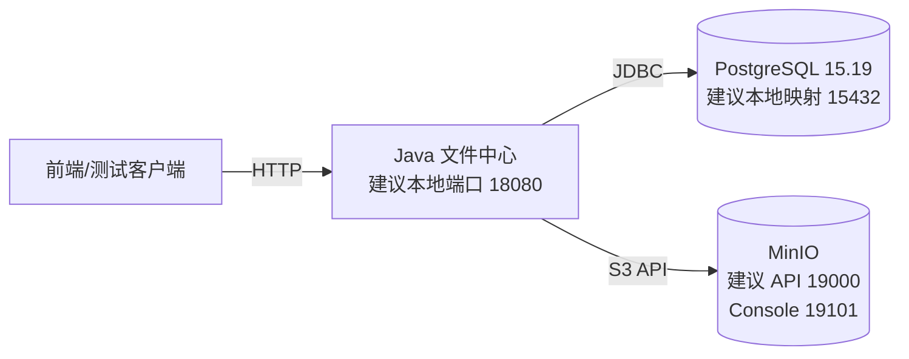

# HLD-002 V0.1.0 部署与运行剖面

- 文档版本：V0.1.0
- 日期：2026-09-03
- 状态：`DRAFT_FOR_USER_REVIEW / NOT_APPROVED_FOR_IMPLEMENTATION`
- 关联文档：`HLD-001-系统架构与技术版本基线.md`

## 1. 目的

本文提出 V0.1.0 需要启动哪些进程、各运行剖面能证明什么，以及配置和凭据边界，供用户评审。它不构成实施授权，并防止把静态契约验证、Mock 或目标架构图误报为真实 RAG 联通。

## 2. V0.1.0 部署单元

| 部署单元 | 形态 | 职责 | 本期状态 |
|---|---|---|---|
| Java 文件中心 | 一个 Spring Boot 可执行 JAR | 文件 HTTP API、生命周期/可用状态、状态历史、业务规则、PostgreSQL/MinIO 编排 | 必需 |
| PostgreSQL | 独立进程/容器 | 文件元数据、双状态、状态历史、并发版本、恢复任务、迁移历史 | 必需 |
| MinIO | 独立进程/容器，私有 Bucket | 文件字节和必要对象元数据 | 必需 |
| Spring Cloud Gateway | 独立响应式 Java 进程 | 未来统一 Java/Python 外部入口 | 本期不启动 |
| Python RAG/Agent | 独立 Python 服务 | 未来检索、问答、Agent 和入库处理 | 本期不启动 |
| RocketMQ Server/Proxy | 独立消息基础设施 | 未来异步入库与结果回传 | 本期不启动 |
| Nacos | 独立配置/发现基础设施 | 未来集中配置和按需服务发现 | 本期不启动 |
| Sentinel | Java 库及规则源 | 未来接口流控 | 本期不启用 |

依据：本期边界来自 2026-09-03 用户原文；三个必需单元来自外部设计输入 `resource-version-baseline.md` 第 3～4、7 节。目标架构版本来自 `spring-cloud-alibaba-baseline.md` 第 3 节。

## 3. 部署拓扑

端口属于本地设计建议，不是外部产品合同。依据为外部设计输入 `resource-version-baseline.md` 第 7.2 节；实际值应由部署配置统一注入，接口测试不得硬编码容器地址。

## 4. 运行剖面

### 4.1 `contract`

目的：在不启动外部中间件时验证 Java DTO、`document_submitted`/`file_fact_changed`/结果 JSON Schema 和固定样本。

启动对象：

- Maven/JDK；
- 契约测试；
- 不启动 Java Web 服务、PostgreSQL、MinIO、RocketMQ 或 Python。

可以证明：静态契约文件有效、正反例解析规则一致、样本哈希未漂移。

不能证明：Java 文件 API、MinIO 文件读取、RocketMQ 消息收发、Python RAG 处理或任何网络联通。

### 4.2 `local-file`

目的：供开发者运行文件管理主流程。

启动对象：

- Java 文件中心；
- PostgreSQL 15.19；
- MinIO 固定本地版本。

行为要求：

- 使用真实 PostgreSQL 和 MinIO；
- 仅绑定本机或部署在受控隔离网络；V0.1.0 没有登录、用户、角色或 ACL，不允许按公网安全系统部署；
- RAG/MQ 发布能力关闭或根本不装配；Schema 文件可以存在但不生成消息；
- 不生成“模拟 RAG 成功”状态；
- Gateway、Nacos、Sentinel、RocketMQ、Python 服务不作为启动前提。

可以证明：当前代码在所用本地实例上的开发行为。若未冻结镜像 digest、配置哈希和测试对象，则不能自动升级为验收证据。

### 4.3 `file-integration`

目的：形成 V0.1.0 文件管理的可重复验收对象。

启动对象与 `local-file` 相同，但增加以下门禁：

1. 记录分支/HEAD、工作树状态、JDK、Maven、依赖树和配置文件哈希。
2. PostgreSQL 和 MinIO 使用 HLD-001 中的精确版本；容器镜像留存 tag，正式证据尽量记录 digest。
3. 从空数据库执行全部 Flyway 迁移，再验证重复启动不产生漂移。
4. 真实执行上传、详情、分页、下载、元数据更新、完整内容替换、启停、状态历史、受控恢复和删除。
5. 故障注入覆盖状态/历史任一写入失败、数据库提交失败、对象删除失败、重复删除、并发替换和并发启停。
6. 检查对象字节、SHA-256、MinIO 元数据、数据库对象引用、双状态和历史一致。

这是 V0.1.0 可以给出文件功能 PASS 的唯一运行剖面。结论必须绑定同一份代码、配置和基础设施对象。

### 4.4 `target-rag`（仅登记，不属于 V0.1.0）

未来启动对象：Gateway、Java 文件中心、Python RAG/Agent、RocketMQ、MinIO、双方数据库，以及按届时需求启用的 Nacos/Sentinel。

该剖面必须另立实施与验收文档。在它被真实执行前，状态固定为 `NOT_RUN`，不能由 `contract` 或 `file-integration` 的结果推导为通过。

## 5. 配置分级

| 配置类型 | 示例 | 存放/注入方式 |
|---|---|---|
| 非敏感应用配置 | 端口、上传开关、允许类型、分页上限、Bucket 逻辑名 | 版本化配置文件；后续可迁移到 Nacos Config |
| 环境地址 | PostgreSQL URL、MinIO Endpoint | 环境变量或部署平台配置 |
| 凭据与密钥 | 数据库密码、MinIO Secret Key、JWT 私钥 | 环境变量或部署平台密钥能力；禁止进入 Git、Nacos 明文样本和文档 |
| 契约常量 | schema version、Topic、Tag、file_ref 前缀、MessageGroup 规则 | 版本化契约文档/Schema；未来运行配置只能选择已支持值 |
| 业务事实 | 文件对象键、SHA-256、生命周期、可用状态、状态历史、并发版本 | PostgreSQL；不得由动态配置改写历史记录 |

配置优先级、变量名和样例值由 LLD 定义。任何样例都不得包含真实 AccessKey、密码、Token 或私钥。

## 6. 启动与就绪门禁

### 6.1 2026-09-03 实施前环境事实

| 检查项 | 本机实时结果 | 判定 |
|---|---|---|
| `java` | Oracle 32-bit JRE `8u491`，Client VM | 不符合 Temurin x64 `8u492-b09` 目标 |
| `javac` | `8u251` | 与 `java` 及目标 JDK 均不一致 |
| Maven | Maven `3.9.14` 使用 `D:\Program Files (x86)\Java\jdk1.8.0_251\jre` | Maven 当前绑定旧的 32-bit Java 路径，工具链分裂 |
| Docker | Client/Server `29.4.3` 可达，Server 为 Linux | 只证明 Docker Engine 当前可用；不证明 PostgreSQL/MinIO 容器已创建、已启动或健康 |

**证据性质**：以上为 2026-09-03 本机实时命令测量，由当前任务环境探针提供。实施前必须显式设置并回读 `JAVA_HOME`、`java -version`、`javac -version` 和 `mvn -version`，四者指向冻结的 Temurin x64 `8u492-b09` 后才能生成正式构建证据。不能用 Maven 当前 `BUILD SUCCESS`（若有）替代工具链对象核对。

Docker 还必须分别检查目标容器、镜像 tag/digest、端口、健康状态和最小读写探针。仅有 Docker Client/Server 版本不构成 PostgreSQL 15.19 或 MinIO 指定版本的运行证据。

### 6.2 应用就绪条件

Java 文件中心达到“就绪”至少要求：

1. 应用上下文启动成功；
2. Flyway Schema 版本符合当前应用；
3. PostgreSQL 可执行最小读写探针；
4. MinIO Endpoint 可访问，目标私有 Bucket 存在且当前凭据具备所需最小权限；
5. 必需配置完整且格式合法。

本期不应因为 RocketMQ、Nacos、Gateway 或 Python 不存在而拒绝启动，因为它们不属于 V0.1.0 运行依赖。健康检查不得返回数据库密码、MinIO 凭据或内部堆栈。

“就绪”只表示本期运行依赖可用，不表示接口已有用户鉴权，也不表示适合暴露到公网。

## 7. 存储资源边界

### 7.1 PostgreSQL

- Java 文件中心使用独立数据库、账号和 Schema；
- 应用账号按实际操作授予权限，不使用数据库超级用户；
- Schema 变更只通过 Flyway 版本化迁移；
- 备份恢复和生产高可用不在当前本地剖面结论内，需单独设计。

### 7.2 MinIO

- Bucket 默认为私有，不向浏览器暴露永久凭据；
- Object Key 使用无路径字符的稳定 `reference_id`，以兼容冻结的 RAG 本地引用合同；
- 对象用户元数据至少保留 `file_name` 和 `media_type`；
- Bucket、Endpoint 与凭据不写进 MQ Body；
- 当前 Server 版本只冻结为本地兼容基线。外部设计输入 `resource-version-baseline.md` 第 5 节明确记录其生产安全与制品来源仍需另审。

## 8. 日志与证据

最低日志关联字段：`request_id`、`file_id`、内部文件流程使用的 `file_workflow_id`、未来 MQ 事件使用的 `operation_id`、必要时的 `reference_id`、操作类型、生命周期和可用状态。日志不得记录文件正文、认证凭据、数据库密码、MinIO Secret Key 或完整 Token。

每次 `file-integration` 验收至少保存：

- Git 对象与工作树状态；
- JDK/Maven/依赖树；
- PostgreSQL、MinIO 的版本和容器标识；
- Flyway 迁移结果；
- API 测试结果；
- 选定文件的原始 SHA-256、数据库 SHA-256 和下载后 SHA-256；
- 启停、生命周期迁移与状态历史的同事务证据；
- 故障注入后的数据库状态、对象状态和补偿结果。

文档、依赖树或健康检查单独通过，都不能替代业务验收链路。

## 9. 进入后续 RAG 阶段的条件

只有满足以下条件，才为 `target-rag` 编写并执行运行方案：

1. `document_submitted`、`file_fact_changed`、acceptance/result JSON Schema 与固定样本完成双方评审；
2. Java 文件对象键、元数据和 SHA-256 规则已在 `file-integration` 通过；
3. RocketMQ 结果 Topic 和 Java Consumer Group 的初始化责任明确；
4. Java 侧文件事实/RAG delivery operation/不可变 Outbox payload/hash 同 PostgreSQL 事务、提交后发送、结果幂等和状态模型已进入新版本范围；
5. Python API 的 HTTP/SSE/WebSocket、认证和超时要求已冻结；
6. Gateway 路由与 Python 直连的验收范围已经定义。

这些是阶段入口条件，不是 V0.1.0 的完成条件。
