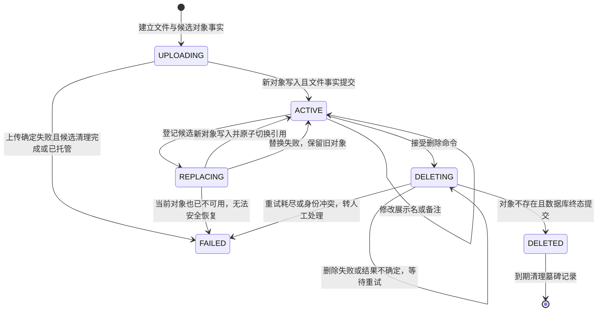

# LLD-001 文件管理模块详细设计

- 文档版本：V0.1.0
- 状态：`DRAFT_FOR_USER_REVIEW / NOT_APPROVED_FOR_IMPLEMENTATION`
- 日期：2026-09-03
- 适用范围：Java 文件中心的文件上传、查询、下载、元数据修改、内容替换和删除
- 不在本期：用户/角色完整实现、Python RAG 运行接入、RocketMQ Producer/Consumer、文件内容在线预览、分片上传、断点续传

## 1. 事实、决定和证据边界

| 类型 | 内容 | 依据 |
|---|---|---|
| 已确认需求 | V0.1.0 先实现 Java 文件管理；只冻结 RAG 对接合同，不真实接入 RAG | 2026-09-03 用户指令 |
| 已确认架构 | Java 文件能力属于模块化单体中的 `file-center-service`，由唯一应用启动模块装配 | `modular-monolith-decision.md` 第 22-34 行 |
| 已确认兼容边界 | 当前 Python RAG 文件取得链路只接受 PDF、DOC、DOCX、XLS、XLSX、JPEG、PNG 七类媒体类型 | RAG 当前工作树 `models/ingestion.py` 第 461-472 行；`adapters/files/minio.py` 第 20-28、121-139 行 |
| 设计决定 | V0.1.0 文件上传只开放上述七类格式，使本期对象天然满足后续 RAG 文件取得格式前置条件 | 本 LLD；这是项目决定，不代表 RAG 已联通 |
| 未验证 | Java MinIO SDK 8.5.17 与当前 MinIO Server 的真实上传、下载、中文文件名元数据行为 | 尚未创建或运行 Java 工程；不得表述为 PASS |

本文引用的 RAG 源码来自 `E:\mytest\szrcb_card_rag` 当前工作树快照。该工作树分支为 `codex/ingestion-lld001-005-checkpoint`，HEAD 为 `3f3ca1fce866d4069d1b5a7d38af451b99c8be59`，且存在大量未提交、删除和未跟踪内容。因此它是本次合同核对对象，不等于干净 HEAD 或正式发布版。

## 2. 模块职责

### 2.1 负责内容

`file-center-service` 负责：

1. 校验上传请求与文件元数据；
2. 为每份文件分配稳定的 `file_id`；
3. 将原始字节写入 MinIO；
4. 将文件事实写入 PostgreSQL；
5. 提供分页查询、详情、下载、元数据修改、内容替换和删除接口；
6. 由 `FileService` 暴露只读 `RagFileFact` 查询，供未来 `file-center-rag` 获取可发布事实；
7. 执行对象存储与数据库之间的失败补偿和对账。

### 2.2 禁止内容

文件模块不得：

- 依赖 RocketMQ SDK、RAG 消息 DTO 或 Python 数据库；
- 在 Controller 中直接调用 Mapper 或 MinIO Client；
- 把 MinIO Bucket、对象键或凭据原样返回给浏览器；
- 把浏览器请求体里的 `user_id` 当作可信操作者身份；
- 通过覆盖同一个对象键来修改文件内容；
- 将文件已上传表述为 RAG 已入库。

模块边界依据：`modular-monolith-decision.md` 第 50-57、120-129 行。最后两项是本 LLD 的一致性和安全设计决定。

## 3. 包与依赖方向

`file-center-service` 在单 Maven 工程内按常规三层主链路分包，并为对象存储和定时补偿保留明确扩展包：

```text
com.example.filecenter.file
├─ controller
│  └─ FileController
├─ dto
│  ├─ request
│  └─ response
├─ service
│  ├─ FileService
│  ├─ FileReconcileService
│  └─ impl
│     ├─ FileServiceImpl
│     └─ FileReconcileServiceImpl
├─ entity
│  ├─ FileRecord
│  ├─ FileStatus
│  └─ ReconcileTask
├─ mapper
│  ├─ FileRecordMapper
│  └─ ReconcileTaskMapper
├─ storage
│  ├─ ObjectStorageService
│  └─ minio
│     └─ MinioObjectStorageService
├─ job
│  ├─ ReconcileJob
│  └─ OrphanObjectScanJob
├─ config
└─ exception
```

依赖方向固定为：

```text
Controller -> Service -> Mapper/DAO -> PostgreSQL
                    \-> ObjectStorageService -> MinioObjectStorageService -> MinIO
Job -> FileReconcileService
```

- `controller` 负责 HTTP 请求解析、Bean Validation、DTO 转换和响应/异常映射，只能调用 `FileService`；不得直接引用 Mapper、`ObjectStorageService` 或 MinIO Client。
- `service` 负责文件状态机、业务校验、事务边界和 PostgreSQL/MinIO 跨资源编排。`FileServiceImpl` 可以直接调用 Mapper 和 `ObjectStorageService`，不再增加通用 Repository 包装层。
- `mapper` 是 DAO 层。MyBatis-Plus 的 `BaseMapper`、分页对象和查询构造器只在 Mapper/数据访问代码内使用，对 Controller 和 Service 的公开方法返回本项目 DTO、实体或分页结果。
- `storage` 中的 `ObjectStorageService` 是项目自定义接口；只有 `storage/minio` 实现可以引用 `io.minio.*` SDK 类型。
- `job` 只负责调度触发，必须调用 `FileReconcileService`；Job 不得直接调用 Mapper、`ObjectStorageService` 或 MinIO Client。
- `entity` 使用普通 Java 对象表达文件记录、状态和补偿任务，不承担 HTTP DTO 职责，也不暴露 MyBatis-Plus 或 MinIO SDK 类型。

该结构保留一个 Spring Boot 进程、一个启动类和一个可执行 JAR。这里的“三层”描述主业务依赖，不表示 MinIO 是关系型 DAO；MinIO 仍通过对象存储接口参与 Service 编排。[设计决定]

## 4. 核心数据模型

### 4.1 `file_record`

| 字段 | 建议类型 | 可空 | 规则与含义 |
|---|---|---:|---|
| `file_id` | `char(32)` | 否 | 主键；32 位小写十六进制；表示逻辑文件，内容替换后保持不变 |
| `reference_id` | `char(32)` | 是 | 当前内容版本 ID；每次创建或替换重新生成；同时作为对象键和未来 RAG `document_id`；首次上传完成前可空 |
| `original_name` | `varchar(255)` | 否 | 上传时原始文件名，去除客户端伪路径后保存 |
| `display_name` | `varchar(255)` | 否 | 用户可修改的展示名；不影响对象键 |
| `remark` | `varchar(1000)` | 是 | 用户可修改备注；不进入 MinIO 元数据 |
| `media_type` | `varchar(128)` | 否 | 规范 MIME；只能取 4.2 的七个值 |
| `size_bytes` | `bigint` | 是 | 上传完成后的实际字节数；必须大于 0；`UPLOADING` 时可空 |
| `content_sha256` | `char(64)` | 是 | 同一上传字节流计算的小写 SHA-256；存在当前内容时必填 |
| `bucket_name` | `varchar(63)` | 否 | 启动配置解析后的逻辑 Bucket；不返回外部 API |
| `object_key` | `varchar(128)` | 是 | 固定等于当前 `reference_id`；不得包含 `/` 或 `\`；首次上传完成前可空 |
| `storage_etag` | `varchar(128)` | 是 | MinIO 返回的对象 ETag；只作对账事实，不冒充 SHA-256 |
| `status` | `varchar(32)` | 否 | `UPLOADING`、`ACTIVE`、`REPLACING`、`DELETING`、`DELETED`、`FAILED` |
| `failure_code` | `varchar(64)` | 是 | 最近一次稳定失败类别；正常状态为空 |
| `row_version` | `bigint` | 否 | 乐观锁版本，从 0 开始，每次业务更新加 1 |
| `created_by` | `varchar(128)` | 否 | 来自可信安全上下文或本地受控身份适配器 |
| `created_at` | `timestamptz` | 否 | 数据库 UTC 时间 |
| `updated_by` | `varchar(128)` | 否 | 最后修改人 |
| `updated_at` | `timestamptz` | 否 | 数据库 UTC 时间 |
| `deleted_at` | `timestamptz` | 是 | `DELETED` 时必填，其余状态为空 |

数据库约束至少包括：

- `primary key (file_id)`；
- `unique (reference_id)` 和 `unique (bucket_name, object_key)`；唯一约束允许首次上传期间的空值；
- `size_bytes > 0`；
- `content_sha256 ~ '^[0-9a-f]{64}$'`；
- `ACTIVE/REPLACING/DELETING` 必须具有 `size_bytes/content_sha256/reference_id/object_key`；
- 状态与 `deleted_at` 的组合检查；
- `object_key = reference_id` 且 `object_key` 不含路径分隔符。

`storage_etag` 不能用作内容指纹。单段上传时 ETag 可能看似 MD5，多段上传语义不同；本系统的内容身份只认 `content_sha256`。[设计决定，非 RAG 原文]

### 4.2 媒体类型白名单

| 文件类别 | MIME |
|---|---|
| PDF | `application/pdf` |
| Word 97-2003 | `application/msword` |
| Word OOXML | `application/vnd.openxmlformats-officedocument.wordprocessingml.document` |
| Excel 97-2003 | `application/vnd.ms-excel` |
| Excel OOXML | `application/vnd.openxmlformats-officedocument.spreadsheetml.sheet` |
| JPEG | `image/jpeg` |
| PNG | `image/png` |

只信浏览器提交的 `Content-Type` 不足以证明真实格式。V0.1.0 至少同时校验扩展名与 MIME 的映射；如引入文件头探测库，探测结果不一致时返回 `FILE_TYPE_MISMATCH`。[设计决定；深度内容识别属于后续安全增强]

## 5. REST API

统一前缀：`/api/v1/files`。响应使用 JSON；下载接口返回字节流。分页参数从 1 开始。

### 5.1 上传

```http
POST /api/v1/files
Content-Type: multipart/form-data

file=<binary>
displayName=<optional string>
```

成功返回 `201 Created`：

```json
{
  "fileId": "4b197c67b4d64352b5d78b5dd6719f93",
  "originalName": "信用卡产品说明.pdf",
  "displayName": "信用卡产品说明.pdf",
  "mediaType": "application/pdf",
  "sizeBytes": 1048576,
  "contentSha256": "aaaaaaaaaaaaaaaaaaaaaaaaaaaaaaaaaaaaaaaaaaaaaaaaaaaaaaaaaaaaaaaa",
  "status": "ACTIVE",
  "version": 1,
  "createdAt": "2026-09-03T06:30:00.000Z"
}
```

说明：上例 SHA-256 是满足格式的占位值，不对应示例文件；正式测试样本必须使用完整、可复算的 64 位值。

处理步骤：

1. Controller 从安全上下文取得 `actor_id` 并传给 `FileService`；本地开发可由受控配置提供固定身份，不从表单接收；
2. 清理客户端伪路径，只保留基础文件名；拒绝空名、前后空白、控制字符、`/`、`\`；
3. 校验文件非空、媒体类型和配置化大小上限；大小上限必须由环境配置提供，本 LLD 不编造数值；
4. 生成稳定 `file_id`、本次操作的 `operation_id` 和本次内容的 `reference_id`；
5. 首个 PostgreSQL 本地事务建立 `UPLOADING` 文件记录和候选对象恢复任务；事务失败时不得调用 MinIO；
6. `FileServiceImpl` 经 `ObjectStorageService` 把新对象流式上传到 `object_key=reference_id`，同时计算 SHA-256 和实际字节数；对象成功后第二个本地事务通过 Mapper 按 `file_id + operation_id + status + row_version` 条件写入当前内容事实并转为 `ACTIVE`；
7. 失败时进入 `FAILED` 或保持可恢复状态，由 LLD-002 的补偿任务收敛。

禁止先把整个文件读入 Java 堆内存。实现应使用有界缓冲流；真正的堆占用和大文件行为需通过后续测试确认。[设计决定]

### 5.2 分页查询

```http
GET /api/v1/files?page=1&pageSize=20&name=信用卡&status=ACTIVE&mediaType=application/pdf&createdFrom=2026-09-01T00:00:00Z&createdTo=2026-09-04T00:00:00Z
```

排序固定为 `created_at DESC, file_id DESC`；`pageSize` 的最大值由配置冻结。默认只返回 `ACTIVE`，不返回 Bucket、对象键、MinIO Endpoint、凭据或内部失败堆栈。非管理调用方不能用 `status` 绕过可见性规则。

### 5.3 查询详情

```http
GET /api/v1/files/{fileId}
```

对 `ACTIVE` 和 `REPLACING` 返回 `200`；后者必须明确返回 `status=REPLACING`，内容字段仍指向旧的当前对象，绝不暴露候选对象。不存在、已删除或当前主体不可见统一按权限策略返回 `404`，避免泄漏对象是否存在。[设计决定，最终鉴权策略需由安全设计确认]

### 5.4 下载

```http
GET /api/v1/files/{fileId}/content
```

处理顺序：`FileService` 先通过 Mapper 查询 `ACTIVE` 或 `REPLACING` 文件的当前对象事实并检查访问权限，再通过 `ObjectStorageService` 打开流。`REPLACING` 期间仍下载旧的当前对象，绝不读取未提交候选对象。响应至少包含：

- `Content-Type: <media_type>`；
- `Content-Length: <size_bytes>`（存储响应可确认时）；
- `Content-Disposition: attachment; filename*=UTF-8''<percent-encoded-name>`；
- `ETag` 使用本系统可控格式，例如由 `content_sha256` 构造，不直接暴露 MinIO ETag。

浏览器下载不获得 MinIO 凭据；V0.1.0 由 Java 转发对象流。预签名 URL 是否引入放到后续版本单独评估。

### 5.5 修改元数据

```http
PATCH /api/v1/files/{fileId}
Content-Type: application/json

{
  "displayName": "2026版信用卡产品说明.pdf",
  "remark": "已由产品部门复核",
  "expectedVersion": 1
}
```

元数据修改只更新 `display_name/remark`，不覆盖对象内容、原始文件名、媒体类型、SHA-256 或对象键。成功后 `row_version + 1`；版本不匹配返回 `409 FILE_VERSION_CONFLICT`。

### 5.6 替换文件内容

```http
PUT /api/v1/files/{fileId}/content
Content-Type: multipart/form-data

file=<binary>
expectedVersion=2
```

替换规则：

1. 目标必须是 `ACTIVE`，并检查 `expectedVersion`；首个本地事务把文件置为 `REPLACING` 并登记候选对象；
2. 保持逻辑 `file_id/display_name/remark`，为新内容生成新的 `reference_id/object_key`；
3. 流式上传新对象并计算新的 `original_name/media_type/size_bytes/content_sha256/storage_etag`；
4. PostgreSQL 条件更新成功后，新引用才生效、状态回到 `ACTIVE` 并递增 `row_version`；
5. `REPLACING` 期间查询详情和下载仍读取旧的当前对象；修改元数据、再次替换和删除被拒绝；
6. 提交后异步删除旧对象；候选上传或切换失败则恢复 `ACTIVE` 并删除候选对象；两种删除失败都进入 LLD-002 的可恢复清理路径；
7. 禁止原地覆盖旧对象键。

未来提交 RAG 时，`document_id` 使用内容版本的 `reference_id`，不能使用替换前后不变的逻辑 `file_id`。原因是当前 RAG 会拒绝第二次注册同一 `document_id`。源码依据：RAG 当前工作树 `adapters/db/task_ledger.py` 第 212-223 行。

### 5.7 删除

```http
DELETE /api/v1/files/{fileId}?expectedVersion=2
```

成功返回 `204 No Content`。删除使用 `ACTIVE -> DELETING -> DELETED`，数据库保留墓碑行；MinIO 删除、数据库终态和重试边界见 LLD-002。对同一 `DELETING/DELETED` 文件重复调用可返回 `204`，实现幂等删除。

## 6. Service 接口

```java
interface FileService {
    FileView upload(UploadFileRequest request, Actor actor);
    FileView get(String fileId, Actor actor);
    PageResult<FileSummary> page(FilePageRequest request, Actor actor);
    DownloadHandle openDownload(String fileId, Actor actor);
    FileView updateMetadata(UpdateFileMetadataRequest request, Actor actor);
    FileView replaceContent(ReplaceFileContentRequest request, Actor actor);
    void delete(DeleteFileRequest request, Actor actor);
    Optional<RagFileFact> findRagFileFact(String fileId);
}

interface FileReconcileService {
    ReconcileBatchResult reconcileDueTasks();
    ReconcileBatchResult scanOrphanObjects();
}
```

`FileServiceImpl` 实现文件 HTTP 用例，直接使用 `FileRecordMapper`、`ReconcileTaskMapper` 和 `ObjectStorageService`。`FileReconcileServiceImpl` 实现补偿、租约领取和孤儿扫描，使用相同的 Mapper/存储边界。两个 Job 只调用 `FileReconcileService` 的两个入口，不包含业务判断或资源访问代码。

Service 方法签名中的 Request、View、`PageResult`、`DownloadHandle`、Actor 和 `RagFileFact` 都是本项目类型，不得使用 Spring MVC 的 `MultipartFile`、MyBatis-Plus 的 `IPage` 或 MinIO SDK 类型作为公开方法参数或返回值。Controller 负责把 HTTP 输入转换为这些类型。

`RagFileFact` 只包含未来生成合同所需的稳定事实：`fileId`、`referenceId`、`fileRef`、`originalName`、`mediaType`、`sizeBytes`、`contentSha256`、`status`。它不包含 Mapper、数据库实体、MinIO Client 或凭据。V0.1.0 只提供只读查询，不得实现 MQ 发布。[设计决定]

## 7. 状态机



`ACTIVE` 可以查询详情、下载、修改、替换或作为未来 RAG 提交来源。`REPLACING` 只允许查询详情和下载旧的当前对象；`UPLOADING/DELETING/DELETED/FAILED` 均不可下载。外部列表默认只返回 `ACTIVE`；管理查询可以查看其他状态。`DELETING` 不等于删除完成。

## 8. 错误合同

| HTTP | 错误码 | 条件 | 可重试性 |
|---:|---|---|---|
| 400 | `INVALID_REQUEST` | 文件名为空、带路径/控制字符，或普通字段非法 | 修正请求后重试 |
| 415 | `UNSUPPORTED_MEDIA_TYPE` | 不在七类白名单，或扩展名与规范 MIME 不一致 | 更换有效文件后重试 |
| 422 | `FILE_EMPTY` | 实际字节数为 0 | 不重试原请求 |
| 413 | `FILE_TOO_LARGE` | 超过部署配置上限 | 缩小文件后重试 |
| 404 | `FILE_NOT_FOUND` | 不存在、已删除或不可见 | 由调用方决定 |
| 409 | `FILE_VERSION_CONFLICT` | 乐观锁版本不一致 | 重新读取后决定 |
| 409 | `FILE_STATE_CONFLICT` | 当前状态不允许该操作 | 重新读取后决定 |
| 503 | `FILE_CONTENT_UNAVAILABLE` | 数据库记录存在但当前 MinIO 对象不可取得 | 记录对账线索后重试 |
| 503 | `OBJECT_STORAGE_UNAVAILABLE` | MinIO 临时不可用 | 可退避重试 |
| 503 | `DATABASE_UNAVAILABLE` | PostgreSQL 暂时不可用 | 不返回成功；由调用方退避重试 |
| 500 | `INTERNAL_ERROR` | 未分类服务异常，包括提交结果无法分类 | 不盲目重传文件；凭 `request_id` 查询日志和对账结果 |

外部响应格式由共享错误合同统一；日志可记录 `request_id/file_id/failure_code`，不得记录文件正文、MinIO Secret、数据库密码或完整令牌。

## 9. 配置项

| 配置键 | 必填 | 说明 |
|---|---:|---|
| `file.storage.endpoint` | 是 | MinIO/S3 API 地址；生产值由部署环境注入 |
| `file.storage.bucket` | 是 | 文件逻辑 Bucket；未来与 RAG Adapter 配置必须一致 |
| `file.storage.secure` | 是 | 是否 TLS |
| `file.upload.max-bytes` | 是 | 正整数；具体数值由容量和需求验收冻结 |
| `file.upload.allowed-media-types` | 是 | 必须等于 4.2 的冻结集合，变更需走 ADR/合同评审 |
| `file.reconcile.orphan-safe-age` | 是 | 未被数据库引用的对象超过多久才可进入孤儿清理；不在本文编造秒数 |
| `file.reconcile.batch-size` | 是 | 单批扫描量；通过运行测试确定 |

Access Key、Secret Key、密码和令牌不得进入仓库或明文 Nacos 样例。

## 10. 实现验收门槛

V0.1.0 Java 文件管理实现完成至少需要：

1. 静态依赖检查证明 Controller 只调用 Service，不直接依赖 Mapper、`ObjectStorageService` 或 MinIO Client；
2. Service 可以调用 Mapper 和 `ObjectStorageService`，但 Service 公开接口不出现 Spring MVC、MyBatis-Plus 或 MinIO SDK 类型；
3. MinIO SDK 类型只存在于 `storage/minio`，两个 Job 只调用 `FileReconcileService`；
4. 七种允许类型和拒绝类型的 API 验证；
5. 大文件有界内存上传和下载验证；
6. 上传成功、MinIO 失败、数据库终态失败三条路径；
7. 替换成功、并发版本冲突、新对象清理失败、旧对象清理失败四条路径；
8. 删除成功、对象已不存在、删除超时三条路径；
9. 中文文件名下载头和 MinIO 元数据读取验证；
10. 同一 `expectedVersion` 并发修改或替换只有一个成功；
11. MinIO 与 PostgreSQL 对账任务能清理孤儿对象、旧版本对象并收敛 `DELETING`；
12. 日志和 API 响应不泄漏凭据、内部对象地址和文件正文。

这些都是后续实现门槛，不是本文已经运行的证据。本文只完成详细设计。
