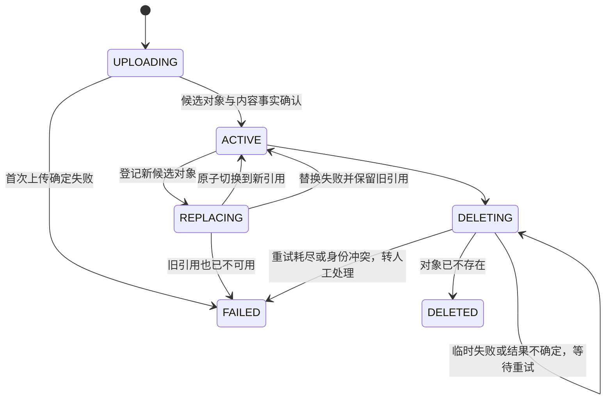
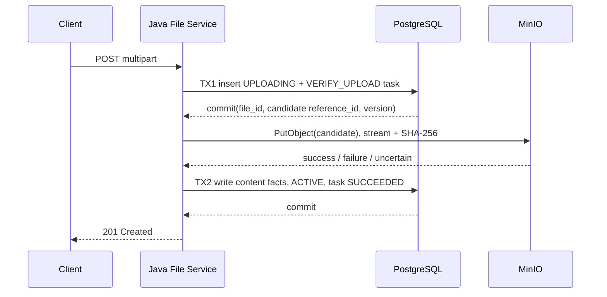
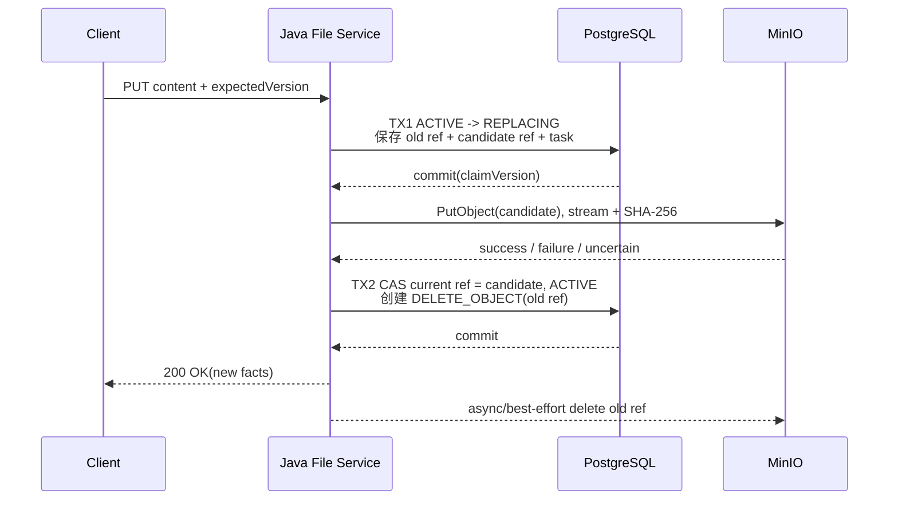
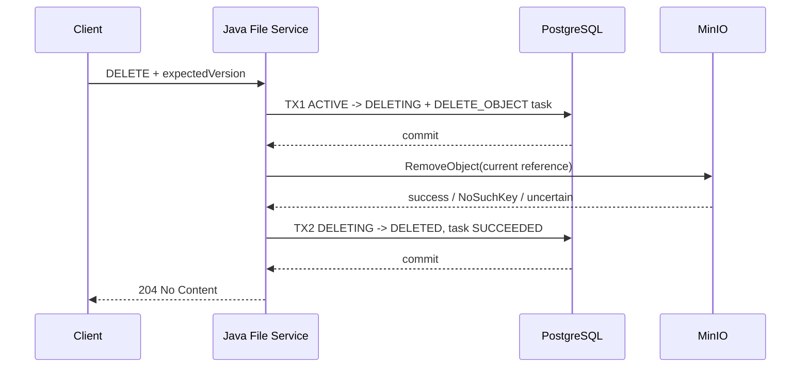

# LLD-002 数据库与 MinIO 一致性设计

- 文档版本：V0.1.0
- 状态：`DRAFT_FOR_USER_REVIEW / NOT_APPROVED_FOR_IMPLEMENTATION`
- 日期：2026-09-03
- 适用对象：Java 文件中心 PostgreSQL 元数据与 MinIO 原始文件

## 1. 设计结论与证据边界

PostgreSQL 本地事务不能把 MinIO 写入或删除纳入同一个原子提交。V0.1.0 使用“文件状态机 + 不可变对象键 + PostgreSQL 乐观锁 + 持久恢复任务 + 孤儿扫描”收敛部分成功，不引入 Seata，不声称两个资源强一致。[设计决定，依据：ADR-004 第 1-3 节]

ADR-004 第 4 节允许 LLD 选择显式创建/替换状态并补全崩溃恢复。本 LLD 具体选择先用 PostgreSQL 登记 `UPLOADING/REPLACING` 与候选 `reference_id`，再调用 MinIO，使进程退出后仍有确定恢复入口；它是对 ADR-004 概要时序的细化。若本 LLD 未获批准，实现不得据此开工。

本设计保证：

- 只有 `ACTIVE` 文件和 `REPLACING` 文件的旧当前对象可下载；
- 首次上传、内容替换和删除在进程崩溃后都有可识别的恢复事实；
- 任何新内容都写新 Object Key，不覆盖当前对象；
- 删除与清理把“对象已不存在”视为幂等成功；
- 重试次数、退避和扫描窗口由配置及真实测试冻结，本文不编造数值。

当前只完成设计。Java 工程、PostgreSQL 表、MinIO Bucket、补偿 Worker 和故障注入测试均未创建或执行。

## 2. 文件状态机

| 状态 | 含义 | 可查询详情 | 可下载 | 可修改/替换 | 可删除 |
|---|---|---:|---:|---:|---:|
| `UPLOADING` | 首次上传已登记，候选对象尚未确认 | 管理视图 | 否 | 否 | 否 |
| `ACTIVE` | 当前引用与对象已确认可用 | 是 | 是 | 是 | 是 |
| `REPLACING` | 新候选对象准备中，旧当前对象仍有效 | 是 | 是，读取旧当前对象 | 否 | 否 |
| `DELETING` | 已接受删除，当前对象清理中 | 管理视图 | 否 | 否 | 重复删除幂等 |
| `DELETED` | 删除完成，对象应不存在 | 管理视图 | 否 | 否 | 重复删除幂等 |
| `FAILED` | 创建、替换或删除清理已达到不能自动安全收口的失败条件 | 管理视图 | 否 | 否 | 仅受控清理 |

默认业务列表只返回 `ACTIVE`。`UPLOADING/REPLACING/DELETING/FAILED` 是真实恢复状态，不能在 API 或日志中伪装为完成。



## 3. 一致性不变量

| 编号 | 不变量 |
|---|---|
| INV-01 | `file_id` 表示逻辑文件，创建后不变 |
| INV-02 | `reference_id` 表示一份不可变内容版本；`object_key=reference_id` |
| INV-03 | 同一 `reference_id` 只能属于一个文件的一次内容版本 |
| INV-04 | `ACTIVE/REPLACING/DELETING` 的当前引用必须具有正数 `size_bytes` 和 64 位小写 `content_sha256` |
| INV-05 | 新建或替换永远生成新 `reference_id`，禁止原地覆盖 |
| INV-06 | ETag 单独保存，不得冒充 SHA-256 |
| INV-07 | `REPLACING` 期间当前引用不变，下载仍读取旧对象，绝不读取候选对象 |
| INV-08 | `DELETED` 对应的当前对象必须不可读取；数据库墓碑保留 |
| INV-09 | MinIO 用户元数据至少有 `file_name` 和 `media_type` |
| INV-10 | 所有存储任务提交结果时必须验证数据库状态、目标引用、乐观版本和 Worker 租约仍匹配 |

INV-09 适配当前 Python RAG MinIO Adapter。源码依据：`E:\mytest\szrcb_card_rag\card-rag-service\src\card_rag_service\adapters\files\minio.py` 第 65-83、92-139 行。

## 4. 存储身份与元数据

### 4.1 Bucket

Bucket 名由 `file.storage.bucket` 注入。未来联调时必须与 Python `CARD_RAG_MINIO_BUCKET` 指向同一 Bucket，因为当前 `file_ref` 不携带 Bucket。RAG 当前本地默认值为 `card-rag-doc-test`，该值只是本地快照，不是生产名称。[已确认，RAG `config.py` 第 35-40 行]

### 4.2 Object Key

```text
file_id      = 逻辑文件 ID，32 位小写十六进制
reference_id = 内容版本 ID，32 位小写十六进制
object_key   = reference_id
```

对象键不得使用原始文件名或 `files/{yyyy}/{MM}/...` 目录形式。当前 Python 本地 Adapter 将 `reference_id` 直接作为对象键，并拒绝 `/`、`\`、`.`、`..`。源码依据：RAG `adapters/files/minio.py` 第 9-11、44-55 行。

### 4.3 用户元数据

| 键 | 值 | 必要性 |
|---|---|---|
| `file_name` | 当前候选对象的原始文件名 | Python Adapter 必需 |
| `media_type` | 规范 MIME | Python Adapter 必需 |
| `file_id` | 逻辑文件 ID | Java 孤儿核对 |
| `reference_id` | 内容版本 ID | Java 孤儿核对 |
| `upload_operation_id` | 本次创建/替换操作 ID | 故障关联 |
| `upload_started_at` | UTC RFC 3339 时间 | 安全窗口判断 |

同时设置对象 `Content-Type=media_type`。Python 当前代码只依赖前两项；后四项属于 Java 补偿设计，不能表述为 RAG 既有要求。

中文 `file_name` 经 Java SDK、MinIO Server、Python SDK 后能否原样读取尚未验证，必须纳入真实组合测试。

## 5. 持久恢复任务

### 5.1 `storage_reconcile_task`

| 字段 | 建议类型 | 说明 |
|---|---|---|
| `task_id` | `char(32)` | 主键 |
| `file_id` | `char(32)` | 逻辑文件 ID |
| `action` | `varchar(32)` | `VERIFY_UPLOAD`、`VERIFY_REPLACEMENT`、`DELETE_OBJECT` |
| `target_reference_id` | `char(32)` | 要验证或删除的对象引用 |
| `source_reference_id` | `char(32)` nullable | 替换前旧引用快照 |
| `expected_file_version` | `bigint` | 创建任务时的文件乐观版本 |
| `task_status` | `varchar(16)` | `PENDING`、`RUNNING`、`SUCCEEDED`、`MANUAL_REVIEW` |
| `attempt_count` | `integer` | 实际尝试次数，从 0 开始 |
| `next_attempt_at` | `timestamptz` | 下一次可领取时间 |
| `lease_owner` | `varchar(128)` nullable | Worker 身份 |
| `lease_expires_at` | `timestamptz` nullable | Worker 租约截止时间 |
| `last_error_code` | `varchar(64)` nullable | 稳定错误码 |
| `created_at/updated_at` | `timestamptz` | 审计时间 |

约束：

- 同一 `target_reference_id + action` 最多一条未终结任务；
- `RUNNING` 必须有 `lease_owner/lease_expires_at`，其他状态必须为空；
- Worker 在短事务内用 `FOR UPDATE SKIP LOCKED` 领取并提交租约，再到事务外访问 MinIO；
- 迟到 Worker 必须因租约、文件状态、引用或版本不匹配而拒绝提交。

### 5.2 孤儿扫描

有些故障发生在对象已经写入、但数据库无法登记恢复任务时，因此只靠任务表不够。孤儿扫描必须：

1. 只扫描本应用独占的私有 Bucket；
2. 只有 PostgreSQL 可读取时才做删除判断；
3. 读取对象的 `reference_id/upload_started_at`；
4. 同时检查 `file_record` 当前引用和所有未终结任务的目标/源引用；
5. 只把超过 `orphan-safe-age` 且无任何引用的对象列为候选；
6. 先写幂等清理事实，再删除对象；
7. 删除成功或 `NoSuchKey` 后终结清理事实。

扫描周期、安全窗口和批量大小无当前运行数据，必须配置化并在测试中记录，本文不写假数字。

## 6. 首次上传



### 6.1 正常路径

1. 请求入口先拒绝已知空文件；若长度未知，则流式读取后的实际大小仍必须大于 0；
2. 生成 `file_id/reference_id/upload_operation_id`；
3. TX1 插入 `file_record(status=UPLOADING)` 和 `VERIFY_UPLOAD` 任务；
4. 使用有界缓冲流写 `object_key=reference_id`，同一读取过程计算字节数和 SHA-256；
5. 空流、非法类型或对象写入失败不得转为 `ACTIVE`；
6. TX2 条件检查 `UPLOADING + reference_id + row_version`，写入内容事实并转 `ACTIVE`；
7. 只有 TX2 提交成功才返回 `201`。

### 6.2 失败矩阵

| 失败点 | 数据库事实 | 对象事实 | 收敛动作 |
|---|---|---|---|
| TX1 失败 | 无文件记录 | 未调用 MinIO | 直接失败 |
| PutObject 明确失败且对象不存在 | `UPLOADING` | 不存在 | 转 `FAILED`，终结任务 |
| PutObject 返回超时 | `UPLOADING` | 未知 | 保持状态，由 `VERIFY_UPLOAD` HEAD/GET 核对 |
| 空流被写成空对象 | `UPLOADING` | 空对象可能存在 | 返回 `FILE_EMPTY`，删除候选并转 `FAILED` |
| PutObject 成功、TX2 失败 | `UPLOADING` | 候选存在 | Worker 从对象重新取得大小、元数据并流式复算 SHA-256，再完成 TX2 |
| 进程退出 | 最后一次已提交状态 | 未知 | 租约/宽限期后 Worker 接管 |
| 对象元数据非法 | `UPLOADING` | 不符合合同 | 删除候选并转 `FAILED`；删除不确定则继续任务 |

ETag 只用于对账辅助。恢复时需要内容哈希，必须对实际对象流重新计算 SHA-256。

## 7. 元数据修改

元数据修改仅更新 PostgreSQL 的 `display_name/remark`，不修改 MinIO `file_name`。`file_name` 是上传时原始文件名，`display_name` 是可变业务事实。

```sql
update file_record
   set display_name = :displayName,
       remark = :remark,
       row_version = row_version + 1
 where file_id = :fileId
   and status = 'ACTIVE'
   and row_version = :expectedVersion;
```

更新行数为 0 时重新查询，区分不存在、状态冲突和版本冲突；禁止静默覆盖。

## 8. 内容替换



规则：

1. TX1 必须匹配 `file_id + status=ACTIVE + expectedVersion`，转为 `REPLACING` 并递增 `row_version`；
2. TX1 同时保存旧引用快照、新候选 `reference_id` 和 `VERIFY_REPLACEMENT` 任务；
3. `REPLACING` 期间当前引用仍是旧引用，查询和下载继续读取旧对象；修改、再次替换和删除返回 `FILE_STATE_CONFLICT`；
4. 新内容写新 Object Key，空文件统一返回 `FILE_EMPTY`；
5. TX2 必须匹配 `REPLACING + candidate + claimVersion`；成功后原子切换 `reference_id/object_key/original_name/media_type/size/hash/etag`，转回 `ACTIVE`；
6. TX2 同一事务创建旧引用的 `DELETE_OBJECT` 任务，因此提交后即使进程退出也能清理旧对象；
7. 候选失败时删除候选并恢复 `ACTIVE`，旧引用不变；
8. CAS 或数据库提交失败时不覆盖旧引用；候选对象立即尝试删除，失败则由任务或孤儿扫描清理；
9. 旧对象删除失败不回滚已经生效的新引用。

若在替换期间发现旧当前对象也已丢失或校验失败，不能无证据恢复 `ACTIVE`；转 `FAILED` 并进入人工处理。

## 9. 删除



删除成功或 `NoSuchKey` 都可完成 TX2。超时或未知结果保持 `DELETING`，后台按同一引用重试。达到配置化重试阈值或出现任务/对象身份冲突时，文件以 CAS 转为 `FAILED`，对应任务转为 `MANUAL_REVIEW`；自动流程不得再宣称删除完成。`DELETING/DELETED` 上重复 DELETE 返回稳定 `204`，不创建第二条流程；`FAILED` 只能通过受控人工处理继续收口。

Bucket 若启用版本控制，仅创建删除标记不代表历史字节物理清除。V0.1.0 部署必须记录版本控制状态；启用时需保存和清理精确 `version_id`，否则只能声称逻辑不可见，不能声称所有历史字节已物理删除。[设计边界]

## 10. Worker 的 ACK 式提交边界

Worker 每次执行：

1. 从数据库领取任务并提交租约；
2. 在事务外调用 MinIO；
3. 开启新事务，检查 `task_id/lease_owner/lease_expires_at`；
4. 同时检查文件状态、`target_reference_id/source_reference_id` 和 `expected_file_version`；
5. 更新文件与任务后提交；
6. 提交失败不报告动作完成，允许租约到期后重新执行。

临时故障回到 `PENDING` 并设置 `next_attempt_at`。达到配置化阈值或出现身份冲突时，任务进入 `MANUAL_REVIEW`；若该任务对应的文件工作流已不能自动安全收口，必须在同一提交边界按预期状态和版本把文件转为 `FAILED`。保存稳定错误码、尝试次数和时间，不保存凭据、文件正文或未经脱敏的响应。人工恢复属于受控运维操作，必须另留审计事实，不计入自动状态转换。

## 11. 与未来 RAG 生命周期的交界

V0.1.0 没有 RAG 运行依赖，因此替换后旧对象可按本设计清理。以后真实接入后，已经发送给 Python 的 `reference_id` 可能仍被在途任务读取；届时删除旧内容前必须检查 RAG operation 是否已终结，或引入明确的引用租约/保留期。不能直接复用 V0.1.0 的即时旧对象清理规则并假设不会打断 RAG。[未来设计门禁]

`storage_reconcile_task` 只处理 Java 数据库与 MinIO，不是 MQ Outbox。V0.1.0 不创建 `rag_ingestion_operation/event_outbox/result_inbox`，也不连接 RocketMQ。

## 12. 验证清单

| 场景 | 期望 |
|---|---|
| 空文件创建/替换 | `FILE_EMPTY`；无可下载记录或候选对象最终清理 |
| 正常创建 | `UPLOADING -> ACTIVE`，字节、大小、SHA 一致 |
| PutObject 超时但实际成功 | API 不误报成功；任务核对后收敛 |
| PutObject 成功、TX2 失败 | Worker 重算对象 SHA 后完成或转人工处理 |
| 正常替换 | `ACTIVE -> REPLACING -> ACTIVE`，新引用生效，旧对象可清理 |
| 两个并发替换 | 只有一个通过 `expectedVersion`；失败者候选不残留 |
| 候选上传失败 | 旧对象继续下载，状态恢复 `ACTIVE` |
| 新引用已提交、旧删除失败 | 新内容可下载，旧对象由任务删除 |
| 正常/重复删除 | 最终 `DELETED`，对象不存在，重复调用稳定 |
| MinIO 删除超时 | 保持 `DELETING`，不可下载，恢复后收敛 |
| 两个 Worker 竞争 | 只有有效租约者能提交 |
| 孤儿扫描 | DB 不可用时不删除；安全窗口内不删除；有引用对象不删除 |
| 中文文件名 | Java 写入后可由 MinIO/Python SDK原样读取；未跑前标记 `NOT_RUN` |

以上均是实现验收门槛，不是本文已执行结果。
