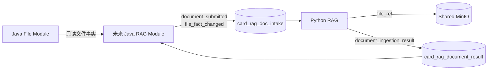

# LLD-003 RAG 预留对接合同

- 文档版本：V0.1.0
- 状态：`DRAFT_FOR_USER_REVIEW / NOT_APPROVED_FOR_IMPLEMENTATION`
- 日期：2026-09-03
- Java 角色：未来的文档入库/逻辑文件事实事件生产者、入库结果消费者
- Python 角色：文档入库事件消费者、入库结果生产者

## 1. 本期范围与证据等级

V0.1.0 只实现 Java 文件管理，本文只冻结后续联调所需的 Topic、Tag、Key、MessageGroup、JSON Body、MinIO 引用、逻辑文件状态、顺序、幂等、未来 Outbox 原子性和失败边界。

V0.1.0 明确不做：

- 不创建 `file-center-rag` 的 Producer、Consumer、RAG delivery operation、Outbox 或 Inbox；
- 不引入或启动 RocketMQ；
- 不创建 intake/result Topic 和 Consumer Group；
- 不向 Python 发送消息；
- 不消费 Python 结果；
- 不运行 Java → MQ → Python → MQ → Java 端到端测试；
- 不声称 RAG 已接入、已联通或已 PASS。

### 1.1 当前核对对象

RAG 源码绝对路径：`E:\mytest\szrcb_card_rag`

| 项 | 当前事实 |
|---|---|
| 分支 | `codex/ingestion-lld001-005-checkpoint` |
| HEAD | `3f3ca1fce866d4069d1b5a7d38af451b99c8be59` |
| 工作树 | 大量已修改、删除和未跟踪内容 |
| 合同含义 | 绑定当前工作树源码快照，不等于干净 HEAD 或正式发布版 |

当前 `models/ingestion.py` 正在进行 Pydantic 2 迁移，但外部字段、字面量和分支校验仍可由当前文件直接核对。联调前必须重新记录分支、HEAD、相关文件 SHA-256 和实际导入位置。

### 1.2 主要源码证据

| 合同事实 | 当前工作树源码 |
|---|---|
| intake/result Topic 默认值 | `card-rag-service/src/card_rag_service/config.py` 第 12-18 行 |
| intake JSON 模型 | `card-rag-service/src/card_rag_service/models/ingestion.py` 第 85-123 行 |
| result JSON 模型与 READY/FAILED 分支 | 同文件第 209-268 行 |
| MQ Envelope 模型 | 同文件第 366-381 行 |
| intake 跨字段校验 | `card-rag-service/src/card_rag_service/application/intake.py` 第 45-64 行 |
| 严格 JSON 入口 | `card-rag-service/src/card_rag_service/application/strict_json.py` 第 28-57 行 |
| intake 适配器及订阅 Tag | `card-rag-service/src/card_rag_service/adapters/mq/consumer.py` 第 28-33、118-190 行 |
| MinIO 引用与元数据 | `card-rag-service/src/card_rag_service/adapters/files/minio.py` 第 9-20、44-83、92-139 行 |
| result Envelope 赋值 | `card-rag-service/src/card_rag_service/adapters/mq/result_producer.py` 第 15-26 行 |
| result Outbox 发送边界 | `card-rag-service/src/card_rag_service/application/result_sender.py` 第 34-54 行 |
| 规范 JSON 与 payload hash | `card-rag-service/src/card_rag_service/application/canonical.py` 第 10-36 行 |
| 当前 MQ 初始化缺口 | `scripts/checkpoint0/init-mq-metadata.ps1` 第 27-36 行只创建 intake Topic/Group |

外部复核材料 `E:\software\codextalklog\artifacts\java_card_service\2026-09-03-backend-resource-version-baseline\compatibility-audit.md` 作为二次整理使用；发生冲突时以本节绑定的当前源码快照为准。

## 2. 拓扑与职责



文件正文不放进 MQ Body。Java 与 Python 通过受控 `file_ref` 指向同一个 MinIO 对象；SHA-256 用于发现对象被替换、错指或传输内容不一致。`document_submitted` 表达一次内容入库请求，`file_fact_changed` 表达同一逻辑 `file_id` 的当前版本、启停和删除事实。

## 3. 版本与资源合同

| 资源 | 冻结值 | 备注 |
|---|---|---|
| RocketMQ Server/Proxy | `5.1.4` | 版本基线；V0.1.0 不启动 |
| Java SDK | `org.apache.rocketmq:rocketmq-client-java:5.0.5` | 后续直接使用，不用 4.x Stream Starter |
| Python SDK | `rocketmq-python-client==5.1.1` | 当前 `pyproject.toml` 第 28 行、`uv.lock` 第 266 行 |
| Intake Topic | `card_rag_doc_intake` | 当前 RAG `config.py` 固定默认值 |
| File fact Tag | `file_fact_changed` | 本项目新增目标合同；复用 Intake Topic，按逻辑 `file_id` 分组 |
| Python Consumer Group | `card_rag_doc_intake_cg` | 当前 RAG `config.py` 固定默认值 |
| Result Topic | `card_rag_document_result` | 当前 RAG `config.py` 默认值；未来同时承载 acceptance 与 ingestion result 两个 Tag |
| Java Result Consumer Group | `java_file_center_rag_result_cg` | Java 新资源；当前 RAG 源码没有该常量 |

两个 Topic 均按 FIFO 资源初始化：`document_submitted` 以 `document_id` 为顺序组，`file_fact_changed` 以 `file_id` 为顺序组，result 以 `operation_id` 为顺序组。当前脚本只初始化 intake Topic/Group，当前 Python Consumer 也只订阅旧 Tag；新 Tag 消费、result Topic 和 Java Group 都是明确的后续资源缺口，V0.1.0 不补建。

平台必须在部署阶段创建和读回 Topic/Group 属性。业务进程不得在启动时偷偷创建或修改 MQ 元数据。当前 intake 脚本也明确采用这一原则：`init-mq-metadata.ps1` 第 1-3 行。

## 4. Java → Python：兼容文档接纳事件

### 4.1 RocketMQ Envelope

| 属性 | 固定值/规则 | Python 校验依据 |
|---|---|---|
| Topic | `card_rag_doc_intake` | `config.py` 第 13 行；`intake.py` 第 45-47 行 |
| Topic 类型 | FIFO | `init-mq-metadata.ps1` 第 27-31 行 |
| Tag | `document_submitted` | `models/ingestion.py` 第 94-95 行 |
| Keys | 恰好一个，值等于 Body `operation_id` | `intake.py` 第 50-51 行 |
| MessageGroup | 等于 Body `document_id` | `intake.py` 第 52-53 行 |
| Body | UTF-8 严格 JSON Object | `strict_json.py` 第 28-57 行 |

### 4.2 JSON 字段

| 字段 | Java 是否发送 | 类型/固定值 | 校验规则 |
|---|---:|---|---|
| `schema_version` | 必须 | string，`"2.0"` | 不接受其他值 |
| `event_type` | 必须 | string，`"document_submitted"` | 必须与 Tag 相同 |
| `operation_id` | 必须 | string | 可见、无首尾空白/控制字符，最多 128 字符；一次提交操作的稳定幂等键 |
| `document_id` | 必须 | string | Python 上游兼容范围为 1..64 个 UTF-8 字节；本项目发送值进一步收紧为 32 位小写十六进制，并等于本次不可变内容的 `reference_id`，不等于可跨替换保持不变的逻辑 `file_id` |
| `file_ref` | 必须 | string | 本项目本地合同固定为 `local-file-ref:v1:<reference_id>`，其中 `reference_id` 是与 `document_id` 相同的 32 位小写十六进制值 |
| `expected_content_sha256` | 必须 | string | 64 位小写十六进制；Python 模型允许省略，但 Java 发送方合同收紧为必填 |
| `knowledge_domain` | 必须 | string，`"credit_card"` | 当前唯一值 |
| `business_document_class` | 必须 | enum | 见 4.3 |
| `access_scopes` | 必须 | string array | 非空、去重；每项可见且 1..128 UTF-8 字节；按 UTF-8 字节序排序 |
| `submitted_by` | 必须 | string | 可见、最多 128 字符；由可信身份或服务身份生成 |
| `submitted_at` | 必须 | RFC 3339 string | 必须携带时区，小数秒最多 6 位；Java 固定输出 UTC 毫秒格式 |

Java 时间格式固定为：

```text
yyyy-MM-dd'T'HH:mm:ss.SSS'Z'
```

不能直接依赖可能输出 9 位纳秒的任意 `Instant.toString()` 结果，因为 Python 当前模型拒绝超过 6 位的小数秒。源码依据：`models/ingestion.py` 第 70-82、122-123 行。

Python 模型配置 `extra="forbid"`，因此 Java 不得擅自增加字段、发送重复 JSON 键、发送 `NaN/Infinity` 或发送非 Object 顶层值。源码依据：`models/ingestion.py` 第 85-86 行；`strict_json.py` 第 28-57 行。

### 4.3 `business_document_class`

允许值精确为：

```text
charter
cardholder_agreement
product_description
campaign_rules
qa_material
fee_description
announcement
short_form_document
```

源码依据：`models/ingestion.py` 第 100-104 行。

### 4.4 有效样例

```json
{
  "schema_version": "2.0",
  "event_type": "document_submitted",
  "operation_id": "7a3e4e927b2146a2acbb6d8636b00431",
  "document_id": "4b197c67b4d64352b5d78b5dd6719f93",
  "file_ref": "local-file-ref:v1:4b197c67b4d64352b5d78b5dd6719f93",
  "expected_content_sha256": "aaaaaaaaaaaaaaaaaaaaaaaaaaaaaaaaaaaaaaaaaaaaaaaaaaaaaaaaaaaaaaaa",
  "knowledge_domain": "credit_card",
  "business_document_class": "product_description",
  "access_scopes": ["cc_customer_service"],
  "submitted_by": "java-file-center",
  "submitted_at": "2026-09-03T07:00:00.000Z"
}
```

样例中的 SHA-256 是满足格式的测试占位值，不代表任何真实文件。跨语言固定向量必须配套实际字节文件并复算哈希。

### 4.5 接纳幂等与冲突

当前 Python 账本语义：

- 同一 `operation_id`、同一规范事件哈希：返回已存在的接纳/拒绝结果；
- 同一 `operation_id`、不同事件哈希：`OperationConflict`；
- 不同 `operation_id` 再提交同一 `document_id`：`DOCUMENT_ID_ALREADY_REGISTERED`；
- 合同合法但业务拒绝属于已确定结果，消费可 ACK；
- 合同解析、Envelope 交叉校验或账本技术故障返回消费失败，交给 MQ 重投。

源码依据：`task_ledger.py` 第 180-223 行；`intake.py` 第 26-28、45-76 行；`adapters/mq/consumer.py` 第 125-190 行。

因此未来 Java 必须把完整发送 Body 冻结在 Outbox 中。重发时复用同一 `operation_id` 和逐字相同的业务事实，禁止根据“当前文件名”等后来变化重新拼 Body。文件内容替换会生成新的 `reference_id/document_id`，避免触发同一 `document_id` 二次注册冲突。V0.1.0 不创建该 Outbox。

## 5. Python → Java：接纳决定事件（真实接入前必须新增）

### 5.1 当前缺口

当前 Python `IntakeUseCase` 可以返回 `IntakeAccepted`、`IntakeRejected` 或 `OperationConflict`，确定性结果会 ACK intake 消息；但当前结果 Outbox 只生成 `document_ingestion_result`，且该模型必填 `task_id`，不能表达“尚未创建任务即被拒绝或发生 operation payload 冲突”。源码依据：`models/ingestion.py` 第 391-409、209-220 行；`task_ledger.py` 第 180-223 行。

这会让 Java 在 `INGRESS_FROZEN`、`CURRENT_GENERATION_UNAVAILABLE`、`DOCUMENT_ID_ALREADY_REGISTERED` 等场景只知道消息已发送，却收不到业务接纳终态。为使合同闭环，真实接入前必须新增以下事件。该事件是本项目冻结的目标合同，当前 Python 尚无模型、Outbox 写入或测试，状态为 `NOT_IMPLEMENTED / NOT_RUN`。

### 5.2 Envelope

| 属性 | 固定值/规则 |
|---|---|
| Topic | `card_rag_document_result` |
| Topic 类型 | FIFO |
| Tag | `document_ingestion_acceptance` |
| Keys | 恰好一个，等于 `operation_id` |
| MessageGroup | 等于 `operation_id` |
| Property `payload_hash` | 规范 JSON UTF-8 的 SHA-256 |
| Body | UTF-8 严格 JSON Object |

使用与最终结果相同的 Topic 和 MessageGroup，使同一操作的 acceptance 在 ingestion result 之前有序到达。Python 必须先持久写入 acceptance Outbox，再允许同一操作写最终 result；Sender 必须按持久顺序发送。只设置 MessageGroup 而不冻结写入顺序，不能证明 acceptance 一定先到。

### 5.3 字段与分支

公共字段：

| 字段 | 类型/规则 |
|---|---|
| `schema_version` | string，固定 `"1.0"` |
| `event_type` | string，固定 `"document_ingestion_acceptance"` |
| `status` | `ACCEPTED`、`REJECTED` 或 `CONFLICT` |
| `operation_id` | 可见 string，最多 128 字符 |
| `document_id` | 与入库事件相同；本项目固定为 32 位小写十六进制 |
| `decided_at` | 带时区 RFC 3339，小数秒最多 6 位 |

严格分支：

| 分支 | 必须字段 | 必须省略字段 |
|---|---|---|
| `ACCEPTED` | `task_id`，32 位小写十六进制 | `rejection_code`、`stored_event_hash`、`incoming_event_hash` |
| `REJECTED` | `rejection_code` | `task_id`、`stored_event_hash`、`incoming_event_hash` |
| `CONFLICT` | `stored_event_hash`、`incoming_event_hash`，均为 64 位小写十六进制 | `task_id`、`rejection_code` |

`rejection_code` V1 允许值：

```text
DOCUMENT_ID_ALREADY_REGISTERED
INGRESS_FROZEN
CURRENT_GENERATION_UNAVAILABLE
```

三项均来自当前 `IntakeRejected`。当前 `OperationConflict` 独立映射为 `CONFLICT`，不得降格成普通业务拒绝。合同非法且无法可信解析 `operation_id/document_id` 的消息不生成 acceptance，按 MQ 失败/DLQ 处理。

### 5.4 ACCEPTED 样例

```json
{
  "decided_at": "2026-09-03T07:00:01Z",
  "document_id": "4b197c67b4d64352b5d78b5dd6719f93",
  "event_type": "document_ingestion_acceptance",
  "operation_id": "7a3e4e927b2146a2acbb6d8636b00431",
  "schema_version": "1.0",
  "status": "ACCEPTED",
  "task_id": "11111111111111111111111111111111"
}
```

### 5.5 REJECTED 样例

```json
{
  "decided_at": "2026-09-03T07:00:01Z",
  "document_id": "4b197c67b4d64352b5d78b5dd6719f93",
  "event_type": "document_ingestion_acceptance",
  "operation_id": "7a3e4e927b2146a2acbb6d8636b00431",
  "rejection_code": "INGRESS_FROZEN",
  "schema_version": "1.0",
  "status": "REJECTED"
}
```

### 5.6 CONFLICT 样例

```json
{
  "decided_at": "2026-09-03T07:00:01Z",
  "document_id": "4b197c67b4d64352b5d78b5dd6719f93",
  "event_type": "document_ingestion_acceptance",
  "incoming_event_hash": "bbbbbbbbbbbbbbbbbbbbbbbbbbbbbbbbbbbbbbbbbbbbbbbbbbbbbbbbbbbbbbbb",
  "operation_id": "7a3e4e927b2146a2acbb6d8636b00431",
  "schema_version": "1.0",
  "status": "CONFLICT",
  "stored_event_hash": "aaaaaaaaaaaaaaaaaaaaaaaaaaaaaaaaaaaaaaaaaaaaaaaaaaaaaaaaaaaaaaaa"
}
```

Python 实现该事件时必须增加严格模型、同账本事务的 Outbox 写入、规范哈希、重复结果幂等和跨语言样例测试；Java 必须在真实接入前同时支持两个 result Topic Tag。

## 6. Python → Java：入库终态结果

### 6.1 RocketMQ Envelope

| 属性 | 固定值/规则 | Python 源码 |
|---|---|---|
| Topic | `card_rag_document_result` | `config.py` 第 16-18 行 |
| Tag | `document_ingestion_result` | `task_ledger.py` 第 524-559 行 |
| Keys | `operation_id` | `result_producer.py` 第 18-23 行 |
| MessageGroup | `operation_id` | `result_producer.py` 第 18-23 行 |
| Property `payload_hash` | 规范 JSON UTF-8 的 SHA-256 | `result_producer.py` 第 24 行；`canonical.py` 第 29-36 行 |
| Body | UTF-8 规范 JSON | `application/result_sender.py` 第 38-43 行 |

### 6.2 公共字段

| 字段 | 类型/固定值 | 规则 |
|---|---|---|
| `schema_version` | string，`"1.0"` | 必须 |
| `event_type` | string，`"document_ingestion_result"` | 必须与 Tag 相同 |
| `status` | `READY` 或 `FAILED` | 终态分支 |
| `operation_id` | string | 与接纳事件一致，最多 128 字符 |
| `document_id` | string | 与接纳事件一致；本项目固定为 32 位小写十六进制 |
| `task_id` | string | 32 位小写十六进制 |
| `completed_at` | RFC 3339 string | 带时区，小数秒最多 6 位 |

### 6.3 READY 分支

`READY` 时：

- `processing_batch_id` 必须存在且为 32 位小写十六进制；
- `index_generation_id` 必须存在且为 32 位小写十六进制；
- `failure_code` 和 `failure_stage` 两个键必须完全省略，不能输出 `null`。

```json
{
  "completed_at": "2026-09-03T07:10:00Z",
  "document_id": "4b197c67b4d64352b5d78b5dd6719f93",
  "event_type": "document_ingestion_result",
  "index_generation_id": "33333333333333333333333333333333",
  "operation_id": "7a3e4e927b2146a2acbb6d8636b00431",
  "processing_batch_id": "22222222222222222222222222222222",
  "schema_version": "1.0",
  "status": "READY",
  "task_id": "11111111111111111111111111111111"
}
```

### 6.4 FAILED 分支

`FAILED` 时：

- `failure_code` 和 `failure_stage` 必须存在、非空、可见；
- `processing_batch_id/index_generation_id` 要么两个键都省略，要么两个都存在且非空；
- Java 不得假设 `failure_code/failure_stage` 是当前固定枚举；先按不透明稳定字符串持久保存。

```json
{
  "completed_at": "2026-09-03T07:10:00Z",
  "document_id": "4b197c67b4d64352b5d78b5dd6719f93",
  "event_type": "document_ingestion_result",
  "failure_code": "SHA256_MISMATCH",
  "failure_stage": "FILE_ACQUISITION",
  "operation_id": "7a3e4e927b2146a2acbb6d8636b00431",
  "schema_version": "1.0",
  "status": "FAILED",
  "task_id": "11111111111111111111111111111111"
}
```

两分支规则直接来自 `models/ingestion.py` 第 209-268 行。Python 规范序列化会排除 `None`，因此 Java DTO 的固定测试向量必须检查“键省略”，不能只检查字段值为 null。

## 7. 规范 JSON 与哈希

Python 当前规范算法为：

1. 对象键按 Unicode 字符串排序；
2. 数组保持原顺序；
3. UTF-8 输出，不把非 ASCII 强制转为 `\uXXXX`；
4. 分隔符使用 `,` 和 `:`，不带多余空格；
5. 时间统一 UTC，固定 6 位微秒；微秒全 0 时输出无小数的 `Z`；
6. 排除值为 `None` 的字段；
7. 对最终 UTF-8 字节计算 SHA-256 小写十六进制。

源码依据：`application/canonical.py` 第 10-36 行。

Java 结果消费者应先严格解析并规范化，再计算哈希并与 RocketMQ 属性 `payload_hash` 比较。不要对“收到的原始字段顺序”直接做业务幂等，因为等价 JSON 的字段顺序可能不同。跨语言实现前必须建立由 Python 和 Java 双向读取的固定哈希向量。

## 8. MinIO 对接合同

### 8.1 引用

```text
file_ref = local-file-ref:v1:<reference_id>
reference_id = object_key = document_id
file_id = Java 逻辑文件 ID，不进入旧 document_submitted/result；进入新 file_fact_changed
```

`reference_id` 必须非空，不得包含 `/`、`\`，不得为 `.` 或 `..`。`file_ref` 不携带 Endpoint、Bucket、Access Key、Secret Key、预签名 URL 或原始文件字节。

旧 `document_submitted v2` 的 `document_id` 等于内容 `reference_id`，替换后会变化；旧 Envelope 又按 `document_id` 分组。因此它既不能把替换前后归到同一顺序组，也不能告诉 RAG 哪个旧文档应退出当前集合。第 14～16 节的新合同专门补齐这一缺口，旧严格 Schema 不原地加字段。

### 8.2 对象事实

Java 上传对象必须：

- 位于双方部署配置约定的同一 Bucket；
- Object Key 等于 `reference_id`；
- 用户元数据含 `file_name` 和 `media_type`；
- `media_type` 属于 LLD-001 §4.2 的七类集合；
- 字节非空；
- Java 发送的 `expected_content_sha256` 与该对象实际字节 SHA-256 相同。

Python 下载时对同一字节流计算 SHA-256 并精确比较，不使用 ETag。源码依据：`adapters/files/minio.py` 第 92-139 行。

### 8.3 已知失败码

当前 Python 文件取得模型包含：

```text
INVALID_FILE_REF
SOURCE_FILE_NOT_FOUND
SOURCE_FILE_EMPTY
INVALID_FILE_METADATA
MEDIA_TYPE_MISMATCH
SHA256_MISMATCH
SOURCE_TEMPORARY_ERROR
LOCAL_FILE_WRITE_FAILED
```

源码依据：`models/ingestion.py` 第 479-484 行。这些码可能出现在未来 FAILED 结果中，但 Java 仍按不透明字符串存储，展示文案由 Java 映射层决定。

## 9. Java 侧未来持久化状态（本期不建表）

### 9.1 `rag_delivery_operation`

```text
INGESTION: NEW -> OUTBOX_PENDING -> WAITING_ACCEPTANCE -> ACCEPTED -> WAITING_RESULT -> READY
                                                        \-> REJECTED                   \-> FAILED
                                                        \-> ACCEPTANCE_CONFLICT
                                                                                       \-> RESULT_CONFLICT

STATE_SYNC: NEW -> OUTBOX_PENDING -> BROKER_ACCEPTED
```

说明：

- `operation_kind` 至少区分 `INGESTION` 与 `STATE_SYNC`；`document_submitted` 以及未来被选为活动入库入口的 `CREATED/CONTENT_REPLACED` 使用前者，其他文件事实事件使用后者；
- `OUTBOX_PENDING` 只表示事件待发送，不代表 Python 已接纳；
- `WAITING_ACCEPTANCE` 只用于 `INGESTION`，表示至少一次发送已得到 Broker 回执；
- `ACCEPTED` 必须来自合法 acceptance 事件，随后进入 `WAITING_RESULT`；
- `REJECTED` 必须来自合法 rejection 事件，是接纳终态；
- `ACCEPTANCE_CONFLICT` 必须来自合法 `CONFLICT` acceptance，表示同一 `operation_id` 对应不同事件哈希，必须人工处理；
- `WAITING_RESULT` 表示 Python 已接纳但尚未返回入库终态；
- 只有收到并持久化合法 `READY` 才能显示“RAG 入库完成”；
- `FAILED` 是 Python 返回的终态；
- `RESULT_CONFLICT` 表示同一操作收到不同终态，必须保留首份结果并报警，禁止后到覆盖先到；
- `BROKER_ACCEPTED` 只用于 `STATE_SYNC`，只证明 Broker 接受了发送，不证明 RAG 已应用状态。若未来 Java 必须观察 RAG 应用终态，应另行版本化状态应用 ACK 合同，不能伪造 ingestion acceptance/result。

### 9.2 `event_outbox`（后续版本）

未来必须在提交文件当前事实的同一个 PostgreSQL 事务中创建 RAG delivery operation 和不可变 Outbox payload/hash。至少保存 `event_id/operation_id/event_type/file_id/file_version/payload_json/payload_hash/status/created_at`；状态建议为 `PENDING/SENDING/SENT`。发送失败回到 `PENDING`，发送成功但标记 `SENT` 失败属于结果不确定，允许重复发送。Sender 只能读取已提交 Outbox，且不得重新查询当前 `file_record` 重建旧 payload。

### 9.3 `rag_result_inbox`

唯一键：`(event_type, operation_id)`。至少保存：

- `payload_hash`；
- 规范 JSON；
- `status`；
- RocketMQ `message_id`；
- 首次接收时间；
- 处理结果。

完全相同的重复结果在数据库事务提交后 ACK；同一键不同 `payload_hash` 不覆盖首份结果，标记冲突并返回消费失败。这个边界与当前 RAG Java 模拟器一致：`test-support/java-result-consumer-simulator/consumer.py` 第 81-134 行。

上述三表及任何文件事实 Outbox 都是后续接入设计，不属于 V0.1.0 Flyway 迁移范围。

## 10. ACK、重试和失败分类

### 10.1 Intake（Python 消费）

| 情况 | Python 当前行为 | Java 责任 |
|---|---|---|
| 合同合法、首次接纳 | 账本提交后 ACK | 等待结果，不重复创建 operation |
| 合同合法、完全重复 | 返回已有结果并 ACK | 可重发同一 Outbox |
| 合同合法、业务拒绝 | 已确定结果，ACK | Python 在同一业务事务写 `REJECTED` acceptance Outbox；当前未实现 |
| 同 operation 不同 payload | 冲突 | Python 写 `CONFLICT` acceptance Outbox；Java 停止变更式重发并人工处理；当前未实现 |
| JSON/Envelope 非法 | 消费失败 | 修复 Producer；不能靠无限重试解决 |
| Python 账本暂时不可用 | 消费失败 | 由 MQ 平台退避重投 |

当前 Python 尚未写出 acceptance。真实接入前必须按第 5 节实现，Java 不能把“已发出”或 RocketMQ ACK 当作“业务已接纳”。

### 10.2 Result（Java 消费）

只有以下步骤全部完成才 ACK：

1. UTF-8、JSON、重复键、额外字段和分支规则校验通过；
2. Topic/Tag/Key/MessageGroup 与 Body 交叉校验通过；
3. `payload_hash` 校验通过；
4. 找到对应 Java operation，`document_id` 匹配；acceptance/result 的状态迁移合法；
5. Inbox 幂等记录和 operation 终态在同一个数据库事务中提交。

数据库不可用、未知 operation、哈希冲突或提交失败均不得 ACK。完全相同的重复消息可在确认既有记录后 ACK。

### 10.3 重试参数边界

当前 `init-mq-metadata.ps1` 明确没有冻结重试次数、退避和 DLQ，只冻结 intake 的 FIFO Topic/顺序 Group（第 27-31 行）。因此本文不编造重试次数和秒数。后续接入必须由部署合同显式冻结并读回：

- 最大投递次数；
- 退避序列；
- 不可见时间；
- DLQ 命名、保留期、告警和人工重放流程；
- 重放时 operation 幂等规则。

## 11. 静态反向样例矩阵

| 样例 | 必须拒绝的原因 |
|---|---|
| intake 增加未知 `bucket` 字段 | 当前模型拒绝额外字段 |
| intake `schema_version="1.0"` | 当前只接受 `2.0` |
| intake SHA 含大写或长度不是 64 | 不满足小写十六进制格式 |
| intake `access_scopes=[]` | 访问范围不能为空 |
| acceptance `ACCEPTED` 同时含 `rejection_code` | 分支禁止字段出现 |
| acceptance `REJECTED` 缺 `rejection_code` 或带 `task_id:null` | 必填/省略规则不满足 |
| acceptance `CONFLICT` 缺任一事件哈希，或同时含 `task_id/rejection_code` | CONFLICT 分支不完整或混入其他分支字段 |
| result `READY` 带 `failure_code:null` | READY 必须完全省略失败键 |
| result `FAILED` 只带一个 batch/generation ID | 两个身份必须同时出现或同时省略 |
| 任意消息含重复 JSON 键、NaN 或数组顶层 | 违反严格 JSON Object 规则 |
| file fact 使用未知版本/未知 `change_type`/额外字段 | 目标合同是严格封闭集合 |
| file fact `file_version <= 0` | 文件事件版本必须为正整数 |
| file fact `file_ref` 后缀与 `document_id` 不同 | 引用与内容身份不一致 |
| `CONTENT_REPLACED` 缺 `previous_document_id` 或新旧 ID 相同 | 无法精确退役旧内容版本 |
| `CREATED` 携带 `previous_document_id` | 创建分支不得伪装成替换 |
| `DELETED` 携带 `file_ref` | 已删除事实不得继续暴露可读引用 |
| `ENABLED/DISABLED` 的目标状态与 Body 不一致 | 变更类型与提交后事实冲突 |

`contracts/rag` 已把正向和反向样例保存为固定 JSON 文件，并提供 `validate_contracts.py`、严格重复键/格式/扩展/跨字段校验和 `SHA256SUMS.txt`。本次文档收口时该静态脚本输出 `SCHEMAS_OK=4`、`VALID_EXAMPLES_OK=14`、`INVALID_EXAMPLES_REJECTED=22`；它只证明当前 Schema、固定样例和项目扩展一致。Java/Python 真实 DTO、Transactional Outbox、RocketMQ 收发、RAG 状态应用和跨服务联通仍为 `NOT_RUN`。

## 12. 版本演进规则

1. `schema_version` 是 Body 合同版本，不是 Java/Python 应用版本；
2. 当前模型拒绝额外字段，因此即使“只加可选字段”，旧消费者也会拒绝；
3. 任何字段增删、枚举扩展、空值/省略规则变化，都先升级消费者，再升级生产者；
4. 不兼容变化使用新的主版本；迁移期需要双读或新 Tag/Topic，不能原地偷换 `2.0/1.0` 含义；
5. `file_ref` 自带 `v1`，新增生产引用方案时由新 Adapter 与新前缀承载；
6. Topic、Tag 或 MessageGroup 改变会影响路由和顺序语义，必须单独 ADR；
7. 合同样本和 JSON Schema 应在 Java 与 Python 仓库各保存一份，并用 SHA-256/跨语言测试防漂移；文档不是可执行锁。
8. 严格的 `document_submitted v2` 不原地增加 `file_id/status`；新能力使用 `file_fact_changed v1` 独立 Tag 和 Schema。
9. 未来启用新事件前必须选择并验证消费迁移策略，不能未经设计同时双发并造成重复入库。

推荐发布次序：

```text
新消费者兼容旧+新合同 -> 验证 -> 新生产者开始发送新合同 -> 观察 -> 删除旧合同
```

## 13. 后续联通门禁

只有以下项目在同一冻结源码和配置对象上通过，才能声称 Java/RAG 联通：

1. 锁定 Java/Python 依赖文件、Git 状态和相关源码哈希；
2. 创建并读回两个 FIFO Topic 和两个有序 Consumer Group；
3. Java intake 样本被当前 Python Pydantic 模型严格解析；Python 新模型能严格解析全部 `file_fact_changed` 分支并拒绝固定反例；
4. Python acceptance 的 ACCEPTED/REJECTED/CONFLICT、最终 READY/FAILED 样本被 Java DTO 严格解析，省略/null 分支均覆盖；
5. Java MinIO SDK 上传、Python MinIO Adapter 下载，文件名、媒体类型、字节数和 SHA-256 全部一致；
6. 同 operation 同 payload 重投幂等；同 operation 不同 payload 冲突；同一 `file_id` 的低版本不覆盖高版本，替换后旧 `document_id` 不再作为当前版本；
7. 结果重复投递只落一份；数据库提交失败前不 ACK；
8. 至少完成一条 Java → RocketMQ → Python acceptance → MinIO → final result → Java 的真实链路并保存 message_id、operation_id 和数据库终态。

V0.1.0 对以上运行项的状态统一为 `NOT_RUN`；只有机器可读 Schema/样例静态验证为 `PASS`。

## 14. Java → Python：逻辑文件事实变更事件

### 14.1 Envelope

| 属性 | 固定值/规则 |
|---|---|
| Topic | `card_rag_doc_intake` |
| Topic 类型 | FIFO |
| Tag | `file_fact_changed` |
| Keys | 恰好一个，等于 Body `operation_id` |
| MessageGroup | 等于 Body 稳定逻辑 `file_id` |
| Property `payload_hash` | 按本文第 7 节规范化 Body 后，对 UTF-8 字节计算 SHA-256 小写十六进制 |
| Body | UTF-8 严格 JSON Object；`schema_version=1.0`；`event_type=file_fact_changed` |
| V0.1.0 状态 | `CONTRACT_ONLY / NOT_SENT / NOT_RUN` |

`operation_id` 是“一份已提交、不可变事件 payload”的唯一幂等身份。删除请求和删除完成是两个提交点，必须使用两个不同 `operation_id`；不能因为来自同一 HTTP 删除意图就让两份不同 payload 共用一个幂等键。需要命令级关联时应在后续合同版本增加独立关联字段，不能重载本字段语义。

本字段不得直接复用 LLD-001、LLD-002 和 ADR-004 中的内部 `file_workflow_id`。该内部 ID 关联一次文件业务流程；涉及对象存储时，可以跨 TX1、事务外对象操作和 TX2 保持不变。MQ `operation_id` 每个已提交事件一值。一个内部流程若先后提交 `DELETE_REQUESTED`、`DELETED`，或提交不同的失败/成功事实，必须为每份不同 payload 生成不同的消息 `operation_id`。两者需要关联时使用内部表关系、日志字段，或在后续 Schema 版本新增独立关联字段。

MessageGroup 使用 `file_id`，因为它在内容替换前后保持不变。旧 `document_submitted` 使用会随替换变化的 `document_id=reference_id`，不能保证同一逻辑文件跨版本顺序。

### 14.2 公共字段

| 字段 | 类型/规则 | 语义 |
|---|---|---|
| `schema_version` | string，固定 `"1.0"` | Body 合同版本 |
| `event_type` | string，固定 `"file_fact_changed"` | 必须与 Tag 一致 |
| `operation_id` | 32 位小写十六进制 | 单份不可变事件及重投幂等身份 |
| `change_type` | 八值枚举 | 本次提交改变了什么 |
| `file_id` | 32 位小写十六进制 | 替换前后不变的逻辑文件身份 |
| `file_version` | 正整数 | 取该事件对应已提交 `file_record.row_version`；同一 `file_id` 单调增加，允许不连续 |
| `lifecycle_status` | `ACTIVE/DELETING/DELETED/FAILED` | 事件提交后的系统生命周期；中间 `UPLOADING/REPLACING` 不对 RAG 发布 |
| `availability_status` | `ENABLED/DISABLED` | 事件提交后的人工可用状态；RAG 的有效可用条件仍是 `ACTIVE + ENABLED` |
| `original_name` | 1..255 字符，无控制字符/首尾空白 | 当前业务元数据 |
| `display_name` | 1..255 字符，无控制字符/首尾空白 | 当前展示元数据 |
| `changed_at` | 带时区 RFC 3339，小数秒最多 6 位 | 数据库事实提交时间 |

可读内容字段为 `document_id/file_ref/media_type/size_bytes/content_sha256`。其中 `document_id` 等于当前内容 `reference_id`，`file_ref` 必须精确等于 `local-file-ref:v1:<document_id>`。`DISABLED` 事件仍携带当前不可变内容事实，供 RAG 识别已有版本；RAG 不得因存在 `file_ref` 就忽略状态并继续对外提供内容。

### 14.3 严格分支

| `change_type` | 生命周期/可用状态约束 | 内容字段 | `previous_document_id` |
|---|---|---|---|
| `CREATED` | `ACTIVE + ENABLED` | 全部必填 | 必须省略 |
| `CONTENT_REPLACED` | `ACTIVE`，可用状态保留原值 | 全部必填 | 必填，且与新 `document_id` 不同 |
| `METADATA_UPDATED` | `ACTIVE` | 全部必填 | 必须省略 |
| `ENABLED` | `ACTIVE + ENABLED` | 全部必填 | 必须省略 |
| `DISABLED` | `ACTIVE + DISABLED` | 全部必填 | 必须省略 |
| `DELETE_REQUESTED` | `DELETING` | 只要求最后 `document_id`；必须省略 `file_ref/media_type/size_bytes/content_sha256` | 必须省略 |
| `DELETED` | `DELETED` | 只要求最后 `document_id`；必须省略可读内容字段 | 必须省略 |
| `FAILED` | `FAILED` | `document_id` 可省略；必须省略可读引用和内容字段 | 必须省略 |

所有分支拒绝未知字段、重复 JSON 键、未知版本、未知变更类型、非法时间和非法 ID。MQ Body 不得出现 Bucket、Object Key、Endpoint、AccessKey、SecretKey、预签名 URL 或文件字节。

### 14.4 `CONTENT_REPLACED` 样例

```json
{
  "availability_status": "ENABLED",
  "change_type": "CONTENT_REPLACED",
  "changed_at": "2026-09-03T08:10:00.000Z",
  "content_sha256": "bbbbbbbbbbbbbbbbbbbbbbbbbbbbbbbbbbbbbbbbbbbbbbbbbbbbbbbbbbbbbbbb",
  "display_name": "信用卡产品说明.pdf",
  "document_id": "319f011f196e49a28583b904b90e0b1e",
  "event_type": "file_fact_changed",
  "file_id": "5ca94af456ee42e28729cd0555a28d01",
  "file_ref": "local-file-ref:v1:319f011f196e49a28583b904b90e0b1e",
  "file_version": 5,
  "lifecycle_status": "ACTIVE",
  "media_type": "application/pdf",
  "operation_id": "22222222222222222222222222222222",
  "original_name": "信用卡产品说明.pdf",
  "previous_document_id": "3ce0160ab3c3498e9be690ab28c0d78b",
  "schema_version": "1.0",
  "size_bytes": 1048576
}
```

机器可读权威文件为 `contracts/rag/file-fact-changed-v1.schema.json` 及 `examples/file-fact-changed.*.json`，本节只解释语义。

## 15. RAG 侧顺序、幂等与当前状态规则（目标合同）

RAG 后续消费者必须按以下次序处理：

1. 严格校验 Envelope、UTF-8 JSON、重复键、Schema 条件分支和规范 payload hash；
2. 以 `operation_id` 查 Inbox：同 payload 重投可 ACK，不同 payload 记冲突且不得覆盖；
3. 以 `file_id` 读取最后应用版本：小于最后版本的是陈旧事件，记录后忽略；等于最后版本且不是同一幂等事件属于冲突；大于最后版本才能继续；
4. 在 RAG 自己的本地事务中应用当前逻辑文件事实并保存新版本；事务提交后才 ACK；
5. `CONTENT_REPLACED` 同一事务中把 `previous_document_id` 退出当前可用集合，并登记新 `document_id`；`DISABLED/DELETE_REQUESTED/DELETED/FAILED` 必须使逻辑文件不可用于检索或回答；只有 `ACTIVE + ENABLED` 可以恢复可用。

当后续版本明确选择 `file_fact_changed` 作为活动入库入口时，只有 `CREATED` 和 `CONTENT_REPLACED` 可以启动文档 ingestion，并产生与该内容事件对应的 `document_ingestion_acceptance` 和 `document_ingestion_result`。`METADATA_UPDATED/ENABLED/DISABLED/DELETE_REQUESTED/DELETED/FAILED` 只应用逻辑文件与状态事实，不得伪造 ingestion acceptance/result；需要重新入库时必须由另行冻结的内容提交命令触发。当前 Python 尚未实现新 Tag 消费、上述路由或状态应用，全部为 `NOT_IMPLEMENTED / NOT_RUN`。

FIFO MessageGroup 提供同组有序投递条件，但不能替代消费者版本检查、Inbox 幂等和本地事务。上述行为当前 Python 尚未实现，V0.1.0 不能把 Schema PASS 表述为 RAG 状态同步 PASS。

## 16. Java 未来 Transactional Outbox 提交点

| Java 已提交事实 | 同一 PostgreSQL 事务必须冻结的 `change_type` |
|---|---|
| 首次上传 TX2，内容事实生效并转 `ACTIVE` | `CREATED` |
| 元数据 PATCH 提交 | `METADATA_UPDATED` |
| 可用状态实际变化提交 | `ENABLED` 或 `DISABLED` |
| 替换 TX2 原子切换新 `reference_id` | `CONTENT_REPLACED`，同时冻结新旧 `document_id` |
| 删除 TX1 转 `DELETING` | `DELETE_REQUESTED` |
| 删除 TX2 转 `DELETED` | `DELETED` |
| 任一工作流安全地提交 `FAILED` | `FAILED` |

每个提交点必须在同一 PostgreSQL 本地事务内写 `file_record`、必要的 `file_status_history`、RAG delivery operation 和完整不可变 Outbox payload/hash；任一写入失败则全部回滚。Sender 在提交后异步发送，结果不确定时重发同一 Outbox 字节，禁止读取较新的文件快照重建旧版本事件。

此处 Outbox 的 `operation_id` 是消息事件 ID；LLD-002 的 `file_workflow_id` 是内部文件流程 ID。实现必须分别建模并建立关联，禁止让跨 TX1/TX2 复用的 `file_workflow_id` 代替多个事件的 `operation_id`。

这不是 PostgreSQL、MinIO、RocketMQ 三方分布式事务。MinIO 上传仍发生在 LLD-002 的 TX1 与 TX2 之间，只有 TX2 切换成功后的内容才能生成 `CREATED/CONTENT_REPLACED`；候选对象和 `REPLACING` 中间态不得发布。V0.1.0 不创建上述 operation/Outbox/Inbox 表，不引入 RocketMQ SDK，不建立 Topic/Group，也不运行 Sender/Consumer。

## 17. 当前工作树证据哈希

以下 SHA-256 用于说明本文实际读取了哪一份未提交工作树内容；后续漂移时必须重新核对：

| 文件 | SHA-256 |
|---|---|
| `config.py` | `17E71BCA6F090EE0BD6D84BDCE7130F79587C67B1126DEF52BD8C8B6990A6980` |
| `models/ingestion.py` | `AF99641EF59547F2843ACA6B7C4B9D3C9C519BA9B310892EB64D2105B761D7A4` |
| `application/intake.py` | `2B5AFF15135ED6F779C34732962365C23F379A2C0129C66EAF124852314DE3DC` |
| `adapters/files/minio.py` | `37654B8F2FF0A9E16DA7A3987ABD03AFB978319CBAFCFF22161EB9A1B5E0C0A5` |
| `adapters/mq/result_producer.py` | `A37AE57870DF7AE7D722F245842B8677DDC7821A806B3C5E86B572FD94EF07AF` |
| `application/result_sender.py` | `13B755C618EEA5663440086970D96649688EF3FC0C3010E5E2B27777DF8C0A80` |
| `scripts/checkpoint0/init-mq-metadata.ps1` | `9308F824A87946EE715802FC248FBDAF24E62DD6728FAAAE833A79675F639834` |

哈希是本次静态核对证据，不是运行 PASS 证明。
