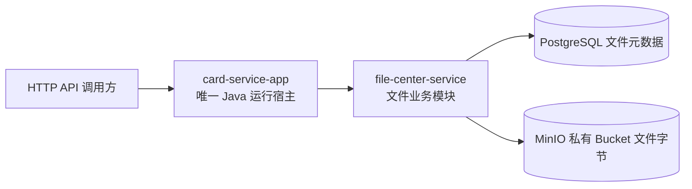
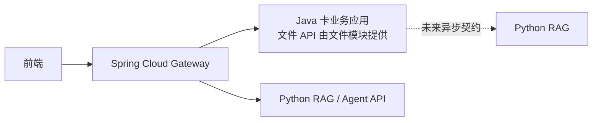

# SRS-001 文件管理系统需求规格

## 0. 文档控制

| 项目 | 值 |
|---|---|
| 文档编号 | `SRS-001` |
| 产品版本 | `V0.1.0` |
| 文档状态 | `DRAFT_FOR_USER_REVIEW / NOT_APPROVED_FOR_IMPLEMENTATION` |
| 本版交付目标 | 完成 Java 文件管理、可用状态与整文件替换设计；冻结未来 RAG 状态同步契约；不进行真实 RAG/MQ 联调 |
| 整体 Java 工程 | `E:\project\java-card-service` |
| 当前业务模块 | `E:\project\java-card-service\file-center-service` |
| 最后更新 | 2026-09-03 |

### 0.1 需求来源与优先级

| 来源编号 | 来源 | 本文用途 |
|---|---|---|
| `SRC-001` | 用户本轮原文：“第一版先只实现Java这边的文件管理功能，定好rag那边的对接契约不真实接入rag” | 冻结 V0.1.0 实现边界和 RAG 证据边界 |
| `SRC-002` | 用户前序原文：“前端是需要直接访问python服务的，python的rag，agent接口是要对前端暴露的” | 记录后续统一入口及 Python 对外 API 边界；不纳入本版实现 |
| `SRC-003` | `E:\software\codextalklog\artifacts\java_card_service\2026-09-03-backend-resource-version-baseline\resource-version-baseline.md` 第 37-46、138-181、194-203 行 | 文件 CRUD、PostgreSQL/MinIO 分工、一致性与验收基础 |
| `SRC-004` | `E:\software\codextalklog\artifacts\java_card_service\2026-09-03-backend-resource-version-baseline\compatibility-audit.md` 第 73-157、159-186 行 | 既有 RAG 消息与文件引用契约，以及尚未运行的证据边界 |
| `SRC-005` | `E:\software\codextalklog\artifacts\java_card_service\2026-09-03-backend-resource-version-baseline\modular-monolith-decision.md` 第 8-20、120-144 行 | Java 单进程边界、文件数据所有权和跨服务合同背景 |
| `SRC-006` | 用户本轮原文：“这个得支持，你先给个设计方案” | 文件可用状态管理必须进入 V0.1.0 |
| `SRC-007` | 用户本轮原文：“我需要Java这边文件修改了也能通过mq提醒rag那边文件现在的状态，这点你有考虑到吗，文档不用支持在线修改，要改文档自己电脑改好重新上传替换原文件就行，Java你这边要做好原子提交” | 冻结整文件替换、状态通知和未来原子提交边界 |
| `SRC-008` | 用户本轮原文：“我们现在版本缺失不接入mq，只是要先定好跟rag那边的契约” | V0.1.0 只交付 MQ/RAG 契约，不接入 MQ 运行时 |
| `SRC-009` | 用户本轮原文：“`E:\project\java-card-service`，这是整体的Java项目，当前是这个项目里的一个模块……后续在整体项目里还要加入其他service的，跟当前项目享用同一个jvm的……别把公共配置全塞当前文件夹里了” | 冻结整体工程根、当前文件模块、未来兄弟模块、单 JVM 和公共配置归属 |

需求冲突时，优先级为用户最新要求 `SRC-009`，再到 `SRC-006`～`SRC-008`、`SRC-001`、`SRC-002`，均高于外部历史基线。外部基线中要求本版真实接入 RocketMQ/Python RAG 的内容被 `SRC-001`、`SRC-008` 覆盖；把文件模块当成整个 Java 工程或独立 Java 进程的描述被 `SRC-009` 覆盖；删除 Gateway 的历史结论被 `SRC-002` 覆盖，但 Gateway 仍属于后续版本，不进入 V0.1.0 实现与验收。

**依据：** `[SRC-001][SRC-002][SRC-006][SRC-007][SRC-008][SRC-009][SRC-004:159-186][SRC-005:131-144]`。

## 1. 目的

V0.1.0 在整体 Java 应用中交付 `file-center-service` 文件管理模块。该模块不能独立启动；它由唯一的 `card-service-app` 启动宿主装配，与后续 Java 业务模块共享一个 JVM。文件模块使用 PostgreSQL 保存文件元数据、系统生命周期、人工可用状态和状态历史，使用 MinIO 保存文件字节，提供文件上传、查询、下载、元数据修改、完整文件替换、启用/停用、受控失败恢复和删除能力。

本版同时产出未来 Java 与 Python RAG 之间的版本化对接契约和固定样例，使创建、整文件替换、元数据修改、启停、删除和失败都能在后续通过 MQ 同步；本版不启动、不调用、不模拟为“真实”的 Python RAG、Agent 或 RocketMQ 链路。

**依据：** `[SRC-001][SRC-006][SRC-007][SRC-008][SRC-009][SRC-003:39-46][SRC-003:159-181]`。

## 2. 产品目标与成功定义

### 2.1 当前版本目标

1. 文件字节与业务元数据分开存储，PostgreSQL 不保存文件 BLOB。
2. 提供完整的文件管理 HTTP API，并能在 PostgreSQL 与 MinIO 的非原子边界上恢复失败；生命周期由系统状态机控制，可用状态由显式接口控制并留下历史。
3. 支持同名文件、中文文件名、流式下载和并发修改冲突检测；拒绝零字节空文件，使文件事实与后续 RAG 文件取得合同一致。
4. 形成可机器校验的 RAG 对接契约，明确逻辑文件身份、内容版本身份、文件版本、当前生命周期/可用状态、顺序、幂等、请求事件和结果事件。
5. 用与证据等级相匹配的措辞报告结果：文件模块功能可以在整体 Java 启动宿主中单独验收，但不能称为独立部署服务；RAG 只允许报告“契约已设计/静态校验”，不得报告“已联通”。

**依据：** `[SRC-001][SRC-006][SRC-007][SRC-008][SRC-003:41-46][SRC-003:175-181][SRC-003:194-203][SRC-004:159-186]`。

### 2.2 V0.1.0 成功定义

V0.1.0 的功能 PASS 必须同时满足：

- 第 13 节所有标为 `MUST` 的 Java 文件管理验收项取得本版本同一代码对象上的执行证据；
- 第 10 节 RAG 契约产物通过静态校验，但没有任何“真实接入”声明；
- 第 11 节范围外组件不是 V0.1.0 启动、运行或验收的前置条件；
- 版本、提交或文件哈希、运行配置档位、测试命令和结果可追溯。

**依据：** `[SRC-001]`；其余为 `[本文验收治理规则，设计选择，非历史运行事实]`。

## 3. 术语

| 术语 | 本文定义 |
|---|---|
| 文件记录 | PostgreSQL 中代表一个逻辑文件的元数据和生命周期记录 |
| 文件内容 | MinIO 中保存的原始字节对象 |
| 文件 ID | 文件记录的稳定外部标识；内容替换后保持不变 |
| Object Key | MinIO 内部对象定位键；不得由原始文件名直接充当 |
| 内容替换 | 保持文件 ID 不变，写入新对象并原子切换文件记录的内容引用 |
| 在线正文编辑 | 在服务端对文档页、段落、单元格或字节片段做增量修改；V0.1.0 不提供该能力 |
| 元数据修改 | 只修改展示名、备注等可编辑字段，不复制或重写文件字节 |
| 删除 | 使文件内容不再可下载，并通过可恢复流程清理 MinIO 对象 |
| 幂等 | 相同意图重复执行时产生稳定结果，不造成重复对象或错误状态跳变 |
| `row_version` | 文件记录的乐观锁版本，用于识别并发修改冲突 |
| `file_version` | 对外事件中的正整数单调版本，取事件所对应已提交文件事实的 `row_version`；允许因内部状态迁移出现间隔，不允许倒退 |
| 生命周期状态 | 由系统工作流控制的 `UPLOADING/ACTIVE/REPLACING/DELETING/DELETED/FAILED`；调用方不能任意赋值 |
| 可用状态 | 由显式接口控制的 `ENABLED/DISABLED`；与生命周期分列保存，不能替代生命周期 |
| 有效可用 | 同时满足 `lifecycle_status=ACTIVE` 且 `availability_status=ENABLED` |
| SHA-256 | 对完整文件原始字节计算的内容指纹；不能用 MinIO ETag 代替 |
| RAG 契约 | 未来 Java 与 Python RAG 对接所需的版本化 JSON Schema、消息 Envelope、文件引用、顺序/幂等规则和固定样例 |
| Transactional Outbox | 未来 MQ 接入时，在文件事实同一个 PostgreSQL 本地事务内保存不可变事件负载，再由事务外发送器投递；V0.1.0 不建表、不发送 |
| 静态校验 | 不启动真实 Python、RocketMQ 或完整跨服务链路，只验证 Schema、样例和序列化规则 |
| 真实接入 | Java 与实际 RocketMQ、Python RAG 及其结果回传链路发生运行时通信 |
| Gateway | 后续供前端统一访问 Java API 与 Python RAG/Agent API 的 HTTP 入口；不属于本版实现 |

**依据：** `[SRC-003:138-181][SRC-004:73-157][SRC-002]`。

## 4. 系统边界

### 4.1 V0.1.0 运行边界

V0.1.0 只有装配了文件模块的 Java 卡业务应用、PostgreSQL 和 MinIO 参与功能执行。API 调用方可以是 Swagger UI、自动化测试或其他 HTTP 客户端；本版不交付前端页面。这里的 `file-center-service` 是 JVM 内模块，不是独立进程。

**依据：** `[SRC-001][SRC-003:39-60][SRC-009]`。

### 4.2 后续系统边界

后续版本中，前端需要调用 Java 文件 API，也需要调用 Python 的 RAG/Agent API。Gateway 作为统一 HTTP 入口进行路由；Java 与 Python 的文档入库协作再按冻结契约接入。该拓扑是后续需求边界，不是 V0.1.0 已实现事实。

**依据：** `[SRC-002][SRC-001][SRC-009]`。

## 5. 角色与权限边界

| 角色 | V0.1.0 能力 | 备注 |
|---|---|---|
| API 调用方 | 调用全部文件管理 API | 本版未实现登录、用户、角色或 ACL |
| 运维/测试人员 | 配置 PostgreSQL、MinIO、文件限制；执行验收和故障注入 | 不通过业务 API取得存储凭据 |
| 后台补偿任务 | 重试未完成的对象清理和状态收敛 | 由 Java 进程内部执行 |
| Python RAG/Agent | 无运行时角色 | 本版只存在静态契约 |

V0.1.0 没有认证和授权能力，因此不得把本版接口描述为“已受用户级权限保护”。部署验收只能在受控的本地或隔离网络内执行。认证、租户隔离和细粒度访问控制必须在对外部署前作为新需求实现。

**依据：** `[SRC-001]`；“本版未实现认证后的部署限制”为 `[安全边界推导，依据：无认证接口不能识别或授权最终用户]`。

## 6. 核心业务对象

### 6.1 文件记录的必需事实

文件记录至少应表达：

- 稳定文件 ID；
- 原始文件名、可修改展示名、备注；
- MinIO Bucket 与 Object Key；
- 字节数、声明媒体类型、SHA-256、MinIO ETag；
- 生命周期状态、可用状态与 `row_version`；
- 状态变更历史：维度、前值、后值、操作者、原因、`request_id`、版本和时间；
- 创建、修改、删除时间。

Bucket、Object Key、MinIO 凭据属于基础设施信息，不得作为普通外部文件详情暴露。客户端声明的媒体类型只能作为声明值保存，不能当作已验证的安全事实。

**依据：** `[SRC-003:140-157][SRC-006][SRC-007]`。

### 6.2 文件生命周期状态

| 状态 | 含义 | 外部行为要求 |
|---|---|---|
| `UPLOADING` | 文件创建尚未完成 | 不得作为可下载的成功文件返回 |
| `ACTIVE` | 元数据与当前对象已经提交 | 是否允许普通下载还取决于可用状态；允许元数据维护、完整内容替换、启停和删除 |
| `REPLACING` | 内容替换处理中 | 详情只能读取旧的已提交当前对象；仅 `availability_status=ENABLED` 时可下载该旧对象；不得暴露半写入的候选对象，其他修改操作被拒绝 |
| `DELETING` | 逻辑删除已开始、对象清理待完成 | 禁止下载和修改；重复删除保持幂等 |
| `DELETED` | 删除流程已完成 | 默认列表不返回；内容不可下载 |
| `FAILED` | 创建、替换或清理流程出现需处理的失败 | 不得假装 `ACTIVE`；必须保留可诊断且不含凭据的错误事实 |

具体状态迁移和数据库字段属于 LLD，但实现不得绕过以下规则：只有有效可用文件可供普通下载；`REPLACING` 且可用状态为 `ENABLED` 时只能下载旧的已提交当前对象；删除进入不可下载状态后再完成对象清理；替换不得原地覆盖当前 Object Key；调用方不得通过通用 PATCH 直接写生命周期。

**依据：** `[SRC-003:152-155][SRC-003:175-181]`。

### 6.3 文件可用状态

| 状态 | 含义 | 外部行为要求 |
|---|---|---|
| `ENABLED` | 允许文件参与普通业务读取 | 仅在生命周期为 `ACTIVE` 时形成有效可用；`REPLACING` 时可继续读取旧的已提交内容 |
| `DISABLED` | 人工暂停文件的业务使用 | 默认列表不返回、下载拒绝、未来 RAG 必须停止把该逻辑文件作为可用知识；仍允许在受控接口中查询详情/历史、修改元数据、整文件替换、重新启用或删除 |

新建文件在成功转为 `ACTIVE` 时默认 `ENABLED`。启停只允许在生命周期为 `ACTIVE` 时执行，并使用 `expectedVersion`；状态值和状态历史必须在同一个 PostgreSQL 本地事务提交。完整内容替换保留原可用状态，不能因上传新文件而自动把 `DISABLED` 改回 `ENABLED`。

本版没有认证和 ACL，因此“人工/受控接口”表示只能在本地或隔离网络调用，不表示已经由管理员角色保护。

**依据：** `[SRC-006][SRC-007]`；双状态、默认值和允许矩阵为 `[本文设计选择，推理依据：生命周期失败恢复与人工上下架是不同责任，混成一个状态会允许调用方绕过系统工作流]`。

## 7. 用例

### UC-001 上传文件

- 参与者：API 调用方。
- 前置条件：Java、PostgreSQL、MinIO 可用；请求满足文件限制。
- 主成功场景：调用方提交文件；系统生成文件 ID 和不冲突的对象标识，流式写入 MinIO并计算 SHA-256，保存元数据，返回新文件记录。
- 失败要求：数据库写入失败时清理已上传对象；若即时清理失败，必须留下可识别并可重试的补偿事实。
- 后置条件：成功时元数据和对象均可查，状态为 `ACTIVE`。

**依据：** `[SRC-003:163][SRC-003:175-181][SRC-003:196-197]`。

### UC-002 分页查询文件

- 参与者：API 调用方。
- 主成功场景：按页返回文件概要，支持名称、状态、创建时间条件和确定性排序。
- 边界：普通业务列表默认只返回 `ACTIVE + ENABLED`；显式管理筛选可查看 `DISABLED` 和其他生命周期，但本版只允许在本地或隔离网络使用。不得把 Bucket、Object Key 或凭据作为普通响应字段。

**依据：** `[SRC-003:164][SRC-003:157]`；敏感基础设施字段边界依据 `[SRC-003:63-65]`。

### UC-003 查询文件详情

- 参与者：API 调用方。
- 主成功场景：使用文件 ID 查询文件元数据和当前状态。
- 异常场景：未知 ID 返回稳定的“不存在”错误；删除后的记录不得被解释为可用文件。

**依据：** `[SRC-003:165][SRC-003:180]`。

### UC-004 下载文件

- 参与者：API 调用方。
- 前置条件：可用状态为 `ENABLED`，且生命周期为 `ACTIVE`，或为 `REPLACING` 且旧的已提交当前对象仍有效。
- 主成功场景：Java 从 MinIO 流式读取并返回文件字节，设置安全的下载文件名和媒体类型。
- 异常场景：对象缺失、MinIO 不可用或文件状态不可下载时返回稳定错误，不泄露堆栈和凭据。

**依据：** `[SRC-003:166][SRC-003:180][SRC-003:201-202]`。

### UC-005 修改文件元数据

- 参与者：API 调用方。
- 主成功场景：修改展示名或备注，通过 `row_version` 检查并发版本。
- 后置条件：MinIO 文件字节、SHA-256、ETag 和 Object Key 不因元数据修改而变化。

**依据：** `[SRC-003:44][SRC-003:167][SRC-003:198]`。

### UC-006 替换文件内容

- 参与者：API 调用方。
- 主成功场景：调用方在自己电脑完成编辑后上传一份完整新文件；系统将全部新字节写入新的 Object Key，计算新 SHA-256，通过 `row_version` 原子切换内容引用，提交后清理旧对象。
- 并发场景：过期 `row_version` 的请求失败并返回冲突，不得覆盖先完成的结果。
- 失败场景：切换失败时当前有效内容仍可恢复；旧对象或候选对象清理失败时进入可重试流程。
- 状态场景：替换保留原 `availability_status`；原文件为 `DISABLED` 时，替换成功后仍为 `DISABLED`。
- 禁止场景：系统不提供页、段落、单元格或字节片段的在线修改接口，也不原地覆盖当前对象。

**依据：** `[SRC-007][SRC-003:168][SRC-003:178][SRC-003:199]`。

### UC-007 删除文件

- 参与者：API 调用方。
- 主成功场景：系统先使文件进入不可下载的删除流程，再清理对象并收敛到 `DELETED`。
- 幂等场景：对同一文件重复提交相同删除意图，返回稳定结果，不创建额外对象或错误恢复为 `ACTIVE`。
- 失败场景：MinIO 暂时失败时保留 `DELETING` 或失败事实，由补偿任务重试。

**依据：** `[SRC-003:169][SRC-003:179][SRC-003:200]`。

### UC-008 补偿与清理

- 参与者：后台补偿任务、运维/测试人员。
- 主成功场景：系统发现数据库写入失败后的孤儿对象、替换后的旧对象或删除中的待清理对象，并在幂等规则下重试清理。
- 后置条件：状态与对象事实最终收敛；失败次数和最后错误可诊断但不含凭据。

**依据：** `[SRC-003:58-60][SRC-003:175-180]`。

### UC-009 静态验证 RAG 对接契约

- 参与者：开发/测试人员。
- 前置条件：契约 Schema 和固定样例已形成版本化文件。
- 主成功场景：`document_submitted v2`、`file_fact_changed v1`、acceptance 和 READY/FAILED 正向样例通过对应 Schema；错误样例被拒绝；版本、变更类型、顺序、幂等和兼容规则明确。
- 后置条件：只能形成 E1 静态证据，不能形成真实跨服务联通证据。

**依据：** `[SRC-001][SRC-007][SRC-008][SRC-004:73-157][SRC-004:159-186]`。

### UC-010 启用或停用文件

- 参与者：API 调用方（仅本地或隔离网络）。
- 前置条件：生命周期为 `ACTIVE`，请求带目标状态、非空原因和当前 `expectedVersion`。
- 主成功场景：系统在一个 PostgreSQL 本地事务中更新 `availability_status`、递增 `row_version` 并追加状态历史。
- 并发场景：旧版本返回 `FILE_VERSION_CONFLICT`；非 `ACTIVE` 生命周期返回 `FILE_STATE_CONFLICT`。
- 后置条件：停用文件不再出现在默认列表且不可下载；重新启用后恢复普通读取资格。

**依据：** `[SRC-006][SRC-007]`；接口和事务规则为 `[本文设计选择]`。

### UC-011 查询状态历史

- 参与者：API 调用方（仅本地或隔离网络）。
- 主成功场景：按 `changed_at DESC, history_id DESC` 稳定分页返回生命周期和可用状态历史。
- 每条记录至少包含维度、前值、后值、原因、操作者、`request_id`、提交后的文件版本和时间。
- 边界：不返回凭据、对象键、文件正文或原始异常堆栈。

**依据：** `[SRC-006]`；历史字段为 `[本文审计设计选择]`。

### UC-012 请求失败恢复

- 参与者：API 调用方（仅本地或隔离网络）、后台补偿任务。
- 前置条件：生命周期为 `FAILED`，存在能够重新核对的持久恢复事实，并携带原因和当前 `expectedVersion`。
- 主成功场景：接口只把对应恢复任务重新置为可执行并追加历史，返回 `202 Accepted`；`FileReconcileService` 随后依据数据库记录和 MinIO 实际事实决定恢复到 `ACTIVE/DELETED`、继续失败或保持人工处理。
- 禁止场景：不得提供任意生命周期 PATCH，不得直接执行 `FAILED → ACTIVE`。

**依据：** `[SRC-006][SRC-007]`；受控恢复规则为 `[本文设计选择，推理依据：失败状态必须由持久事实证明后才能收敛]`。

## 8. 功能需求

### 8.1 文件 API

| 编号 | 级别 | 需求 |
|---|---|---|
| `FR-FILE-001` | MUST | 系统必须提供 `POST /api/v1/files`，接收 `multipart/form-data` 并创建文件记录与 MinIO 对象。 |
| `FR-FILE-002` | MUST | 系统必须为每次成功创建生成稳定且不可由文件名推导的文件 ID；同名文件不得互相覆盖。 |
| `FR-FILE-003` | MUST | 系统必须在读取上传流的同一过程中计算完整字节 SHA-256，并与 MinIO ETag 分字段保存。 |
| `FR-FILE-004` | MUST | 系统必须提供 `GET /api/v1/files` 分页查询，支持名称、状态和创建时间条件，并使用稳定排序。 |
| `FR-FILE-005` | MUST | 系统必须提供 `GET /api/v1/files/{id}` 查询单文件元数据。 |
| `FR-FILE-006` | MUST | 系统必须提供 `GET /api/v1/files/{id}/content` 并采用流式响应；只有 `availability_status=ENABLED` 才允许下载，`ACTIVE` 下载当前对象，`REPLACING` 只能下载旧的已提交当前对象，其他状态或 `DISABLED` 均拒绝下载。 |
| `FR-FILE-007` | MUST | 系统必须提供 `PATCH /api/v1/files/{id}` 修改展示名、备注等可编辑元数据；该操作不得重写文件内容。 |
| `FR-FILE-008` | MUST | 系统必须提供 `PUT /api/v1/files/{id}/content` 替换文件字节，使用新 Object Key 和乐观锁切换内容引用。 |
| `FR-FILE-009` | MUST | 系统必须提供 `DELETE /api/v1/files/{id}`，删除语义必须幂等，并能在 MinIO 暂时失败后重试。 |
| `FR-FILE-010` | MUST | 系统必须对文件名执行 CR/LF、路径字符和响应头注入防护；Object Key 不得直接使用原始文件名。 |
| `FR-FILE-011` | MUST | 系统必须把 PostgreSQL 和 MinIO 的部分成功保存为可恢复状态，不得声称 `@Transactional` 能回滚 MinIO。 |
| `FR-FILE-012` | MUST | 默认文件详情和列表响应不得暴露 MinIO 凭据、Bucket、Object Key 或长期公开 URL。 |
| `FR-FILE-013` | MUST | API 必须使用统一错误响应，并满足第 9 节错误语义。 |
| `FR-FILE-014` | MUST | OpenAPI 文档必须包含本版全部文件 API、主要字段和稳定错误码。 |
| `FR-FILE-015` | MUST | 系统必须拒绝零字节空文件并返回 `FILE_EMPTY`；失败请求不得产生 `ACTIVE` 文件记录或不可识别对象。该规则是当前设计选择，依据是未来 RAG Adapter 会拒绝空文件，不是用户原文。 |
| `FR-FILE-016` | MUST | 系统必须把人工可用状态独立建模为 `ENABLED/DISABLED`，提供 `PATCH /api/v1/files/{id}/availability`；请求必须包含目标状态、非空原因和 `expectedVersion`，且仅允许生命周期为 `ACTIVE` 的文件启停。 |
| `FR-FILE-017` | MUST | 系统必须提供 `GET /api/v1/files/{id}/status-history` 稳定分页查询，返回生命周期/可用状态的前值、后值、操作者、原因、`request_id`、提交后版本和时间。 |
| `FR-FILE-018` | MUST | 系统必须提供 `POST /api/v1/files/{id}/actions/retry-recovery` 受控恢复入口；只允许为 `FAILED` 且存在持久恢复事实的文件重新排队，不得接受任意生命周期赋值或直接执行 `FAILED → ACTIVE`。 |
| `FR-FILE-019` | MUST | 系统不得提供在线正文增量编辑接口；文件正文修改只能由调用方上传完整新文件到 `PUT /api/v1/files/{id}/content`，保持逻辑 `file_id` 和原可用状态，生成新的 `reference_id/object_key` 后原子切换 PostgreSQL 当前引用。 |

**依据：** `[SRC-003:138-181][SRC-003:194-203][SRC-006][SRC-007]`。

### 8.2 配置需求

| 编号 | 级别 | 需求 |
|---|---|---|
| `FR-CFG-001` | MUST | 数据库地址、账号、密码必须由 `card-service-app` 的运行配置或环境变量注入；真实密码不得写入仓库或文档，`file-center-service` 不得维护独立 DataSource 运行配置文件。 |
| `FR-CFG-002` | MUST | MinIO Endpoint、Access Key、Secret Key、Bucket 的运行值必须由 `card-service-app` 或环境变量注入；文件模块可以定义专属配置类型和校验，Secret Key 不得进入日志或错误响应。 |
| `FR-CFG-003` | MUST | 单文件大小上限、单请求大小上限和允许媒体类型策略必须作为文件模块专属配置键可配置，由启动宿主提供实际值，并在验收对象中记录。 |
| `FR-CFG-004` | MUST | 补偿任务的执行周期、单次处理上限、重试次数或退避规则必须作为文件模块专属配置键可配置，由启动宿主提供实际值。 |

**依据：** `[SRC-003:117-126]`。具体数值尚未由用户确认，见第 15 节待决项。

### 8.3 RAG 契约需求

| 编号 | 级别 | 需求 |
|---|---|---|
| `FR-RAG-001` | MUST | 必须定义 Java 提交文档给 RAG 的版本化请求 Schema；当前兼容基线为 `schema_version=2.0`、`event_type=document_submitted`。 |
| `FR-RAG-002` | MUST | 请求契约必须区分稳定 `document_id` 与单次操作 `operation_id`，并包含版本化 `file_ref`、`expected_content_sha256`、分类/访问范围、提交方和带时区提交时间。 |
| `FR-RAG-003` | MUST | 必须定义 RAG 返回 Java 的版本化接纳结果 Schema；目标合同为 `schema_version=1.0`、`event_type=document_ingestion_acceptance`，覆盖 `ACCEPTED`、`REJECTED` 与 `CONFLICT` 三个互斥分支。当前 Python 尚未实现该事件，状态固定为 `NOT_IMPLEMENTED / NOT_RUN`。 |
| `FR-RAG-004` | MUST | 接纳结果三分支必须用“字段存在/字段完全省略”表达：`ACCEPTED` 只带 `task_id`，`REJECTED` 只带 `rejection_code`，`CONFLICT` 只带两项事件哈希；禁止字段即使为 `null` 也必须拒绝。 |
| `FR-RAG-005` | MUST | 必须定义 RAG 返回 Java 的版本化最终结果 Schema；当前兼容基线为 `schema_version=1.0`、`event_type=document_ingestion_result`，覆盖 `READY` 与 `FAILED` 分支。 |
| `FR-RAG-006` | MUST | READY/FAILED 必填、可省略和禁止字段必须通过 Schema 表达；不得用“所有字段输出为 null”代替分支契约。 |
| `FR-RAG-007` | MUST | 必须定义 `local-file-ref:v1:<reference_id>` 的本地联调格式、字符约束、MinIO 元数据 `file_name`/`media_type` 和 SHA-256 校验规则。 |
| `FR-RAG-008` | MUST | 契约必须提供可机器校验的正向样例和反向样例；反向样例至少覆盖额外字段、错误版本、错误哈希、非法时间及 acceptance/READY/FAILED 分支错误。 |
| `FR-RAG-009` | MUST | 契约文档必须明确 Topic、Tag、Key、MessageGroup、编码、幂等键与兼容性规则，但本版不得引入运行时生产者、消费者或 RocketMQ 启动依赖。 |
| `FR-RAG-010` | MUST | V0.1.0 的 RAG 验收只执行静态 Schema/样例校验；任何跨 SDK、跨服务、MQ 收发或端到端结论均标记 `NOT_RUN`。 |
| `FR-RAG-011` | MUST | 必须在不修改严格 `document_submitted v2` 语义的前提下，新增 `schema_version=1.0`、`event_type=file_fact_changed` 的版本化目标 Schema，表达 `CREATED/CONTENT_REPLACED/METADATA_UPDATED/ENABLED/DISABLED/DELETE_REQUESTED/DELETED/FAILED`。 |
| `FR-RAG-012` | MUST | `file_fact_changed` Envelope 必须使用 Topic `card_rag_doc_intake`、Tag `file_fact_changed`、Key `operation_id`、MessageGroup `file_id` 和按规范 JSON 计算的 `payload_hash` Property；每份不同 payload 使用独立事件 `operation_id`，不得复用跨 TX1/TX2 的内部 `file_workflow_id`；Body 必须携带正整数单调 `file_version`，内容替换必须同时携带新 `document_id` 与不同的 `previous_document_id`。 |
| `FR-RAG-013` | MUST | `file_fact_changed` 必须严格拒绝未知版本、未知变更类型、额外字段、重复 JSON 键和条件分支错误；内容可读事件必须携带 `document_id/file_ref/media_type/size_bytes/content_sha256`，`DELETED` 不得携带可读 `file_ref`。 |
| `FR-RAG-014` | MUST | 必须冻结未来原子发布规则：文件事实、RAG delivery operation 和不可变 Outbox payload/hash 在同一个 PostgreSQL 本地事务提交；提交前不得发送 MQ，且旧事件不得从后来的文件快照重新生成。V0.1.0 只记录该规则，不创建相关表或运行组件。 |

**依据：** `[SRC-001][SRC-007][SRC-008][SRC-004:73-157][SRC-004:159-186][SRC-005:131-144]`。

## 9. 错误语义与异常验收

### 9.1 统一错误响应

所有非成功响应至少包含稳定 `error_code`、面向调用方的 `message`、用于日志关联的 `request_id` 和带时区 `timestamp`。响应不得包含 Java 堆栈、SQL、数据库连接串、MinIO 凭据、内部 Bucket/Object Key 或本机绝对路径。

**依据：** `[SRC-003:202]`；响应字段为 `[本文接口治理设计选择，非外部基线原文]`。

### 9.2 最小错误目录

| 场景 | HTTP 状态 | 稳定错误码 | 验收要求 |
|---|---:|---|---|
| 请求字段或分页参数非法 | `400` | `INVALID_REQUEST` | 指出可公开的字段错误，不返回内部异常 |
| 文件 ID 不存在 | `404` | `FILE_NOT_FOUND` | 未知 ID 稳定返回同一语义 |
| 生命周期或可用状态不允许当前操作 | `409` | `FILE_STATE_CONFLICT` | 例如下载 `DISABLED/DELETING` 文件、对非 `ACTIVE` 文件启停、无恢复事实时请求恢复 |
| `row_version` 已过期 | `409` | `FILE_VERSION_CONFLICT` | 不覆盖已提交修改 |
| 文件超过已配置上限 | `413` | `FILE_TOO_LARGE` | 不产生 `ACTIVE` 记录或不可识别孤儿对象 |
| 零字节空文件 | `422` | `FILE_EMPTY` | 不产生 `ACTIVE` 记录或不可识别孤儿对象 |
| 媒体类型不符合已配置策略 | `415` | `UNSUPPORTED_MEDIA_TYPE` | 策略关闭时不得误报拒绝 |
| 文件元数据存在但对象不可取得 | `503` | `FILE_CONTENT_UNAVAILABLE` | 保留可诊断事实，不返回假内容 |
| MinIO 暂时不可用 | `503` | `OBJECT_STORAGE_UNAVAILABLE` | 需要补偿的写操作进入可重试状态 |
| PostgreSQL 暂时不可用 | `503` | `DATABASE_UNAVAILABLE` | 不返回成功；已写对象必须补偿或可识别 |
| 未分类服务异常 | `500` | `INTERNAL_ERROR` | 响应只提供 `request_id`，详细错误仅进入受控日志 |

HTTP 状态和错误码是当前 SRS 的外部行为基线；更细的错误字段和异常映射在 LLD 中冻结。

**依据：** 故障场景来自 `[SRC-003:175-181][SRC-003:200-202]`；状态码与错误码为 `[本文设计选择，推理依据：使用标准 HTTP 语义并让自动化测试可稳定断言]`。

## 10. RAG 静态契约边界

### 10.1 本版必须冻结的契约面

1. Java → RAG 兼容入库请求 `document_submitted v2` 的 Envelope 和 JSON Schema；该严格 Schema 保持原义。
2. Java → RAG 逻辑文件事实 `file_fact_changed v1` 的 Envelope、JSON Schema、八种变更类型、顺序与幂等规则。
3. RAG → Java 接纳结果消息 Envelope 和 JSON Schema，以及 `ACCEPTED/REJECTED/CONFLICT` 三分支规则。
4. RAG → Java 最终结果消息 Envelope 和 JSON Schema，以及 `READY/FAILED` 两分支规则。
5. 本地 `file_ref` 格式、MinIO 元数据和 SHA-256 规则。
6. `operation_id`、`file_id`、`file_version`、`document_id` 的身份、顺序与幂等含义。
7. 兼容版本、未知版本、未知变更类型、额外字段、重复键和可省略字段策略。
8. 正向/反向固定 JSON 测试向量及静态校验命令。
9. 未来同一 PostgreSQL 事务保存已提交文件事实、RAG delivery operation 和不可变 Outbox payload/hash 的原子边界。

`file_fact_changed v1` 用稳定 `file_id` 对同一逻辑文件的所有版本排序，补齐旧 `document_submitted v2` 只含 `document_id=reference_id`、无法表达替换关系和当前可用状态的缺口。接纳结果则补齐当前 Python 接纳决定不可见的缺口。两者都是目标合同；当前 Python 尚未实现对应模型、Outbox 和测试，状态为 `NOT_IMPLEMENTED / NOT_RUN`。

**依据：** `[SRC-004:73-157]`。

### 10.2 本版禁止形成的结论

以下结论在 V0.1.0 一律为 `NOT_RUN`：

- Java RocketMQ Producer 能把 `document_submitted` 或 `file_fact_changed` 发送给真实 Python Consumer；
- 文件事实、RAG delivery operation 与 Outbox payload/hash 已在同一 PostgreSQL 事务提交；
- Python 能读取本版 Java 写入的 MinIO 对象；
- Python 能发送 `document_ingestion_acceptance` 接纳结果；
- Python RAG 能完成解析、切块、Embedding、索引或 Agent 调用；
- Python 结果消息能被 Java Consumer 幂等落库；
- Gateway 能把前端请求路由到 Java/Python；
- Java → MQ → Python RAG → MQ → Java 端到端 PASS。

不得使用历史 RAG PoC 的局部收发证据替代本项目、本版本、本次运行对象的端到端证据。

**依据：** `[SRC-001][SRC-004:159-186]`。

## 11. 明确不在 V0.1.0 范围

### 11.1 业务与产品能力

- 前端页面；
- 登录、注册、JWT、用户、角色、租户和 ACL；
- 文件夹树、标签体系、分享链接、回收站恢复和历史版本下载；
- 在线预览、在线正文增量编辑、转码、OCR、病毒扫描、内容审核；完整文件上传替换仍属于本版范围；
- 全文检索、向量检索、知识库管理；
- 断点续传、分片上传、秒传、跨区域容灾。

**依据：** `[SRC-001][SRC-003:46]`；登录/权限排除以 `[SRC-001]` 的“只实现 Java 文件管理”为当前版本解释。

### 11.2 服务与中间件能力

- Spring Cloud Gateway 的部署、路由和验收；
- Nacos 注册发现或配置中心真实接入；
- RocketMQ Server/Proxy、Java Producer/Consumer 和 Python Consumer/Producer；
- Python RAG、Python Agent、Embedding、LLM、Elasticsearch、Milvus；
- Java 与 Python 的任何真实网络调用；
- MQ/RAG Outbox、RAG 入库状态表和结果消费幂等表。

可以在文档或 Schema 中出现这些后续边界，但它们不得成为本版 Java 文件 CRUD 的编译、启动和验收前置条件。

**依据：** `[SRC-001]`；后续边界来源 `[SRC-002][SRC-004:73-186]`。

## 12. 非功能需求

### 12.1 数据完整性与一致性

| 编号 | 级别 | 需求 |
|---|---|---|
| `NFR-DATA-001` | MUST | PostgreSQL 只保存元数据与对象引用，不保存文件 BLOB。 |
| `NFR-DATA-002` | MUST | `(bucket_name, object_key)` 必须唯一；同名文件使用不同对象键。 |
| `NFR-DATA-003` | MUST | SHA-256 必须由实际上传字节计算；ETag 单独保存且不得冒充 SHA-256。 |
| `NFR-DATA-004` | MUST | 上传、替换、删除必须有明确的部分失败补偿路径和可重试状态。 |
| `NFR-DATA-005` | MUST | 并发修改和替换必须通过 `row_version` 防止丢失更新。 |
| `NFR-DATA-006` | MUST | 每次生命周期或可用状态变更必须与对应状态历史在同一个 PostgreSQL 本地事务提交；任一写入失败时两者都不得提交。 |

**依据：** `[SRC-003:41-44][SRC-003:144-157][SRC-003:175-181][SRC-006][SRC-007]`。

### 12.2 性能与资源

| 编号 | 级别 | 需求 |
|---|---|---|
| `NFR-PERF-001` | MUST | 上传和下载必须使用流式 I/O；不得存在把任意大小文件整体读入 JVM `byte[]` 的实现路径。 |
| `NFR-PERF-002` | MUST | 列表接口必须分页并限制单页最大条数；具体最大值在 LLD/配置基线冻结。 |
| `NFR-PERF-003` | MUST | 大小上限必须在写入完成前被框架或应用拒绝；失败后不得留下不可识别对象。 |
| `NFR-PERF-004` | SHOULD | 验收应记录测试文件大小、JVM 堆配置、响应时间和峰值内存，避免无测量地声明性能能力。 |

**依据：** `[SRC-003:124-126][SRC-003:164][SRC-003:166][SRC-003:201]`。

V0.1.0 不冻结 TPS、并发数或响应时间 SLA，因为当前没有用户量、文件大小分布、部署资源和业务峰值证据。任何性能数字必须在负载模型明确后标为测量或估算，不能伪装成事实。

**依据：** `[当前信息缺口；本文判断，非外部测量]`。

### 12.3 安全

| 编号 | 级别 | 需求 |
|---|---|---|
| `NFR-SEC-001` | MUST | MinIO Bucket 必须为私有；本版不返回长期公开 URL。 |
| `NFR-SEC-002` | MUST | 凭据只能由外部配置注入，不得写入源码、Git、文档、日志或响应。 |
| `NFR-SEC-003` | MUST | 原始文件名不得直接成为 Object Key；下载文件名必须防止路径穿越和响应头注入。 |
| `NFR-SEC-004` | MUST | 错误响应不得泄露堆栈、SQL、内部地址、对象定位或凭据。 |
| `NFR-SEC-005` | MUST | 在认证未实现前，运行环境必须限制为本地或受控隔离网络，不得宣称公网安全。 |

**依据：** `[SRC-003:65][SRC-003:119-125][SRC-003:136][SRC-003:171][SRC-003:180][SRC-003:202]`；隔离要求为 `[安全边界推导]`。

### 12.4 可观测性与可诊断性

| 编号 | 级别 | 需求 |
|---|---|---|
| `NFR-OBS-001` | MUST | 每个请求生成或接收 `request_id`，并在错误响应与日志中关联。 |
| `NFR-OBS-002` | MUST | 上传、替换、删除和补偿任务记录稳定的文件 ID、操作类型、结果与错误码；日志不得记录文件字节和凭据。 |
| `NFR-OBS-003` | MUST | PostgreSQL 与 MinIO 健康状态必须可区分，健康检查不得回显连接凭据。 |
| `NFR-OBS-004` | SHOULD | 补偿任务应暴露待处理数、成功数和失败数的可测量指标。 |

**依据：** 故障可诊断需求来自 `[SRC-003:175-181][SRC-003:202]`；具体可观测字段为 `[本文设计选择]`。

### 12.5 兼容性与可维护性

| 编号 | 级别 | 需求 |
|---|---|---|
| `NFR-MAIN-001` | MUST | 整体 Java 工程必须采用 Maven 多模块模块化单体：`file-center-service` 是普通业务 JAR，只有 `card-service-app` 可以包含 `main`、Spring Boot repackage、整体运行配置和全局异常映射；文件模块只定义文件领域异常/错误码，内部仍须满足 Controller → Service → Mapper/DAO 方向及 MinIO SDK 隔离。 |
| `NFR-MAIN-002` | MUST | 组件版本及其状态由 HLD 单一版本基线维护，并由整体根父 POM/BOM、Wrapper、整体 Compose 和启动宿主配置实际强制；不得在 `file-center-service` 重建一套整体构建与公共配置。 |
| `NFR-MAIN-003` | MUST | RAG JSON 契约必须显式携带 `schema_version`，并拒绝不支持版本、重复 JSON 键和未声明字段。 |
| `NFR-MAIN-004` | MUST | V0.1.0 必须可以在不启动 Gateway、Nacos、RocketMQ、Python 或向量数据库的条件下完成 Java 文件功能验收。 |

**依据：** `[SRC-003:63-65][SRC-001][SRC-004:73-157][SRC-009]`。

## 13. 可验证验收标准

### 13.1 Java 文件管理

| 验收编号 | 级别 | 验收步骤与通过条件 | 最低证据等级 |
|---|---|---|---|
| `AC-FILE-001` | MUST | 上传已知字节文件；PostgreSQL 记录和 MinIO 对象同时存在；重算 SHA-256 与记录相等；状态为 `ACTIVE`。 | E2 |
| `AC-FILE-002` | MUST | 连续上传两个同名文件；得到不同文件 ID 和对象；分别下载后内容与各自原文件一致。 | E2 |
| `AC-FILE-003` | MUST | 上传中文文件名的非空文件后可查询和下载，响应头无乱码或注入；上传零字节文件返回 `422 FILE_EMPTY`，且不产生 `ACTIVE` 记录或不可识别对象。 | E2 |
| `AC-FILE-004` | MUST | 创建超过一页的数据，按名称、状态、时间查询；页大小受限、排序稳定、无重复或漏项。 | E2 |
| `AC-FILE-005` | MUST | 查询存在和不存在的文件 ID；字段、状态、HTTP 状态与错误码符合契约，且不暴露内部对象定位。 | E2 |
| `AC-FILE-006` | MUST | 下载大于应用普通 JSON 响应体量的测试文件；字节和 SHA-256 一致；代码检查与运行测量均未出现整文件 `byte[]` 聚合。 | E2 |
| `AC-FILE-007` | MUST | PATCH 展示名和备注；数据库字段更新，`row_version` 增加；对象字节、SHA-256、ETag、Object Key 不变。 | E2 |
| `AC-FILE-008` | MUST | PUT 新内容；替换处理中下载仍返回旧的完整对象且绝不返回候选半成品；提交后文件 ID 不变，SHA-256 与内容引用切换，旧对象最终清理，新内容可下载。 | E2 |
| `AC-FILE-009` | MUST | 使用同一旧 `row_version` 并发替换；最多一个成功，其他请求返回 `FILE_VERSION_CONFLICT`，成功内容不被覆盖。 | E3 |
| `AC-FILE-010` | MUST | 删除后文件不可下载，默认列表不返回；重复删除结果稳定；对象最终清理。 | E2 |
| `AC-FILE-011` | MUST | 删除过程中使 MinIO 暂时失败；记录保持可重试状态；恢复 MinIO 后补偿任务收敛到 `DELETED`。 | E3 |
| `AC-FILE-012` | MUST | 在对象上传成功后注入数据库写入失败；接口不返回成功；对象被即时补偿或被清理任务准确识别并最终删除。 | E3 |
| `AC-FILE-013` | MUST | 分别模拟 PostgreSQL、MinIO 不可用及未知异常；响应错误码稳定，无堆栈、连接串、凭据和 Object Key。 | E3 |
| `AC-FILE-014` | MUST | OpenAPI 中可以查到第 8.1 节全部接口、请求/响应和主要错误码。 | E1 |
| `AC-FILE-015` | MUST | 对 `ACTIVE` 文件使用当前 `expectedVersion` 执行 `ENABLED → DISABLED → ENABLED`；每次实际变化后状态正确、`row_version` 递增，且状态值与对应历史在同一事务同时存在。 | E2 |
| `AC-FILE-016` | MUST | 对 `UPLOADING/REPLACING/DELETING/DELETED/FAILED` 文件请求启停返回 `FILE_STATE_CONFLICT`；两个相同旧版本的并发启停最多一个成功；`DISABLED` 文件不在默认列表且下载被拒绝。 | E3 |
| `AC-FILE-017` | MUST | 查询状态历史时，生命周期和可用状态记录按 `changed_at DESC, history_id DESC` 稳定分页；逐条核对维度、前后值、操作者、原因、`request_id`、版本和时间，且不泄露对象定位或凭据。 | E2 |
| `AC-FILE-018` | MUST | 对具有持久恢复事实的 `FAILED` 文件请求恢复只把对应任务重新排队并返回 `202`；无恢复事实或非 `FAILED` 返回冲突；代码和 OpenAPI 中不存在任意生命周期赋值接口，最终状态只能由 `FileReconcileService` 核对真实事实后提交。 | E3 |
| `AC-FILE-019` | MUST | 静态检查确认不存在页/段落/字节增量正文编辑接口；运行 `PUT /content` 上传完整新文件后，`file_id` 与原可用状态不变，新 `reference_id/object_key` 生效、旧对象最终清理，且当前 Object Key 从未被原地覆盖。 | E2/E3 |

**依据：** `[SRC-003:185-203]`，并补充了与本 SRS 错误目录、状态和并发规则对应的可执行步骤。

### 13.2 RAG 契约

| 验收编号 | 级别 | 验收步骤与通过条件 | 最低证据等级 |
|---|---|---|---|
| `AC-RAG-001` | MUST | 使用标准 JSON Schema 校验器验证 Java → RAG 正向样例；全部通过。 | E1 |
| `AC-RAG-002` | MUST | 验证 RAG → Java acceptance 的 `ACCEPTED`、`REJECTED` 与 `CONFLICT` 正向样例；三分支必填/省略规则全部通过，同时报告 Python 实现状态为 `NOT_IMPLEMENTED / NOT_RUN`。 | E1 |
| `AC-RAG-003` | MUST | 验证 RAG → Java 最终结果的 `READY` 与 `FAILED` 正向样例；各分支必填/省略规则全部通过。 | E1 |
| `AC-RAG-004` | MUST | 使用额外字段、未知版本、非法哈希、非法时间、acceptance/READY/FAILED 错误分支字段的反向样例；校验器逐项拒绝。 | E1 |
| `AC-RAG-005` | MUST | 文档能从每个 Schema 字段追溯到含义、必填性、长度/格式、幂等身份和兼容策略。 | E0 |
| `AC-RAG-006` | MUST | 验收报告明确记录真实 RocketMQ、Python、MinIO 跨 SDK 与端到端链路为 `NOT_RUN`。 | E0 |
| `AC-RAG-007` | MUST | `file_fact_changed v1` 的 `CREATED/CONTENT_REPLACED/METADATA_UPDATED/ENABLED/DISABLED/DELETE_REQUESTED/DELETED/FAILED` 八个正向样例全部通过 Schema 和项目跨字段校验。 | E1 |
| `AC-RAG-008` | MUST | 新合同的未知版本、未知变更类型、额外字段、重复键、零 `file_version`、引用不一致、替换缺旧 ID/新旧 ID 相同、创建混入旧 ID、删除暴露 `file_ref`、内容字段缺失和状态分支不匹配样例逐项被拒绝。 | E1 |
| `AC-RAG-009` | MUST | 静态核对 Envelope 为 Topic `card_rag_doc_intake`、Tag `file_fact_changed`、Key `operation_id`、MessageGroup `file_id` 和规范 `payload_hash` Property；文档明确事件 `operation_id` 与内部 `file_workflow_id` 分离，RAG 按事件 ID/哈希去重、按 `file_version` 拒绝陈旧事件，并在替换时使用 `previous_document_id` 退役旧文档。 | E1 |
| `AC-RAG-010` | MUST | 静态核对 ADR/LLD 明确未来 Outbox 与文件事实同事务、提交前不发 MQ、事件负载不可变；同时仓库中不存在本版 Outbox/RAG 状态表、Producer/Consumer、Topic/Group 初始化或 MQ 运行配置。 | E1 |

**依据：** `[SRC-001][SRC-007][SRC-008][SRC-004:73-157][SRC-004:159-186]`。

## 14. 证据等级与声明规则

| 等级 | 名称 | 可以证明 | 不能证明 |
|---|---|---|---|
| `E0` | 文档证据 | 需求、设计、字段与边界已经记录 | Schema 可解析、代码可运行、组件可联通 |
| `E1` | 静态证据 | Schema/样例通过校验，OpenAPI 或依赖结构可静态检查 | PostgreSQL/MinIO 运行行为，真实跨服务通信 |
| `E2` | 本地功能证据 | Java + PostgreSQL + MinIO 在冻结对象上的单功能/主流程实际运行结果 | 故障恢复、Python/RAG、生产能力 |
| `E3` | 本地故障与恢复证据 | 在明确故障注入下验证补偿、幂等、并发和状态收敛 | 真实 Python/RAG 联通或生产 SLA |
| `E4` | 跨服务联通证据 | Java、MQ、Python RAG、共享文件边界在同一冻结环境中的真实链路 | 生产规模、生产安全和长期稳定性 |
| `E5` | 生产证据 | 指定生产环境、负载与观测窗口内的实际行为 | 未覆盖环境、未覆盖负载或未来版本 |

声明规则：

1. 当前文档完成本身只能形成 `E0`。
2. RAG 契约在 V0.1.0 最高形成 `E1`；没有真实接入时不得使用“联调通过”“端到端通过”“兼容 PASS”。
3. Java 文件功能总 PASS 至少需要全部 MUST 项达到其表中最低等级；只有正常 CRUD 的 E2 不能替代故障恢复 E3。
4. 所有执行证据必须绑定项目路径、代码版本或文件哈希、配置档位、依赖锁、命令、时间和原始结果。
5. 历史 PoC、其他仓库或其他 HEAD 的结果只能作为参考，不能替代当前对象证据。

**依据：** `[SRC-001][SRC-004:159-186][SRC-005:90-118]`；分级名称为 `[本文证据治理设计选择]`。

## 15. 当前待决项

以下数值或策略没有用户原文和当前运行测量，本文不伪造为已确认事实。它们必须在实现前由 HLD/LLD 或配置基线冻结，并在验收报告中记录实际值：

| 编号 | 待决项 | 未决影响 | 建议收口位置 |
|---|---|---|---|
| `OQ-001` | 单文件和单请求大小上限 | 影响上传拒绝、反向代理和流式验收文件大小 | HLD 配置基线 + LLD API |
| `OQ-002` | 整体 Maven 根和启动宿主如何纳入 Git | 当前 `.git` 只覆盖 `file-center-service`；父 POM、`card-service-app` 和未来兄弟模块无法由当前仓库直接追踪 | 实施前单独确定 monorepo、父仓库或其他版本控制方案；不得由实施者移动/初始化 Git |
| `OQ-003` | 列表默认页大小和最大页大小 | 影响接口稳定性与性能测试 | LLD API |
| `OQ-004` | 删除墓碑保留多久 | 影响历史审计与物理清理策略；保留墓碑这一方向已经确定 | ADR/LLD 状态机 |
| `OQ-005` | 补偿重试次数、退避和人工处置阈值 | 影响 E3 故障验收 | LLD 一致性设计 |

媒体类型已经由 LLD-001 按当前 RAG 文件取得合同收口为七类；空文件按 `FR-FILE-015` 明确拒绝。两项都是待用户审阅的设计选择。其他数值不得由实现者无记录地自行选择。

**依据：** `[SRC-003:124-126][SRC-003:185-192]`；媒体类型与空文件处理为 `[设计选择，非用户原文；当前 RAG Adapter 的 SOURCE_FILE_EMPTY/媒体类型封闭集合是兼容性依据]`。

## 16. 需求追踪与验收入口

V0.1.0 的唯一需求追踪矩阵是：[RTM-V0.1.0 需求追踪与验收矩阵](../governance/RTM-V0.1.0.md)。

本 SRS 保留需求正文、`AC-*` 验收标准、证据等级和声明规则；治理矩阵负责把每条 `FR-*`、`NFR-*` 连接到 HLD/ADR/LLD、外部契约、验收检查和当前证据状态。正式验收必须从治理矩阵逐行执行，不能只按原有目标分组抽样。

为防止两份矩阵漂移，本文不再复制矩阵内容。矩阵摘要与本文措辞冲突时，以本 SRS 的需求和验收原文为准。

**依据：** `[本文需求到验收的治理规则；矩阵位置经当前文档结构调整]`。

## 17. 当前证据状态

截至 2026-09-03，本文件完成需求设计，文档本身为 `E0`；机器可读 RAG 合同已执行本目录静态验证器，形成 `E1` 静态证据。本次没有创建或检查 Java 业务源码，没有启动 Java、PostgreSQL、MinIO、Gateway、RocketMQ 或 Python RAG，也没有执行文件功能测试。因此：

- Java 文件管理功能：`NOT_IMPLEMENTED / NOT_RUN`；
- RAG 契约静态校验：`STATIC_CONTRACT_VALIDATION=PASS`（4 份 Schema、14 个有效样例、22 个无效样例、SHA-256 清单）；
- Java 与 Python 真实接入：`OUT_OF_SCOPE / NOT_RUN`；
- V0.1.0 总体验收：`NOT_RUN`。

**依据：** `[SRC-001][SRC-008]`、`lld/contracts/rag/validate_contracts.py` 的当前实际输出与本次仅修改文档/静态合同的工作范围；历史基线也记录真实跨服务闭环尚未运行 `[SRC-004:166-169]`。固定计数随合同文件集合变化，后续必须重新执行脚本，不能沿用本次数字。
